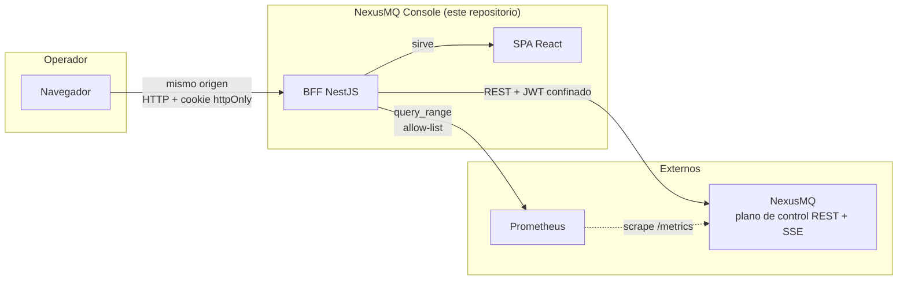

# 2. Contexto y motivación

> Por qué un broker necesita una consola, por qué esta consola es un proyecto **separado**
> del broker, y qué tesis técnica sostiene. Es el capítulo del *porqué*.

## 2.1 El punto de partida: un broker sin cara

[NexusMQ](https://github.com/AOjeda006/NexusMQ) es un broker de mensajería distribuido en
C++23 con arquitectura *shared-nothing thread-per-core* y **Raft por partición**. Expone
tres planos bien separados:

- **plano de datos** — *produce*/*fetch* por protocolo binario nativo o subconjunto Kafka;
- **plano de consenso** — RPC de Raft entre réplicas;
- **plano de control** — API REST `/api/v1`, salud (`/healthz`, `/readyz`) y `/metrics`.

El plano de control es completo y está bien diseñado, pero es *máquina a máquina*. Operarlo
significa encadenar `curl` y leer JSON, o exponer `/metrics` a Prometheus y montar tableros
genéricos. Ninguna de las dos cosas responde bien a la pregunta que un operador se hace de
verdad: **¿está sano esto, y si no, dónde duele?**

Responderla exige correlacionar, en la misma pantalla y al mismo tiempo:

- el **throughput** por api (`produce`/`fetch`) y su tendencia;
- las **latencias por percentil**, que son lo único que describe la cola de la distribución;
- la **tasa de error** en proporción a las peticiones, no en absoluto;
- las **conexiones activas** por plano;
- el **estado del consenso**: quién lidera cada partición, con qué término, cuánto va
  retrasado cada seguidor.

Esa correlación es un problema de **diseño de información**, y es el que resuelve la consola.

## 2.2 Por qué un proyecto separado

La consola podría haber vivido dentro del repositorio del broker, servida por el propio
`nexusd`. No se hizo, por cuatro razones:

1. **Disciplina de contrato.** Al ser un repositorio distinto, la consola **solo** puede
   apoyarse en lo que el broker publica: su `openapi.yaml` y su catálogo de métricas. No hay
   atajos por conocimiento interno. Si algo no está en el contrato, no existe. Esta
   restricción es deliberada y es la que mantiene honesta la integración.
2. **Ciclos de vida distintos.** El broker es C++ compilado, con *sanitizers* y dos
   *toolchains*; la consola es TypeScript con Vite y Playwright. Mezclar sus puertas de
   calidad habría penalizado a ambos.
3. **Superficie de ataque separada.** El broker no debería tener que servir HTML ni gestionar
   sesiones de navegador. Mantener la consola fuera deja el core libre de esa
   responsabilidad, coherente con su propia separación plano de datos / plano de control.
4. **Despliegue independiente.** La consola escala, se actualiza y se reinicia sin tocar el
   broker; puede apuntar a distintos despliegues sin recompilar nada.

## 2.3 La tesis técnica

Un cliente de operación se juzga por tres cosas, y la consola está construida alrededor de
ellas:

**Primera: la frontera de confianza tiene que estar en algún sitio concreto.** En una SPA
"pura" que llama al broker desde el navegador, el token del operador vive en `localStorage`
y el broker queda expuesto a CORS y a cualquier XSS. Aquí la frontera es el **BFF**: es la
única pieza que conoce la URL del broker y el único lugar donde vive el token. El navegador
recibe una cookie opaca y nada más. Todo el capítulo [9](./09-autenticacion-y-sesiones.md)
desarrolla esta decisión.

**Segunda: el tiempo real no es "abrir un WebSocket".** Es decidir qué pasa cuando el
*upstream* cae, cuando el cliente es más lento que la fuente, y cuando el transporte deja de
estar disponible. La consola responde a las tres: reconexión con *backoff* + *jitter* que no
tumba la conexión del navegador, **backpressure acotado** que pausa la lectura del broker
hasta que el socket del cliente drena, y caída a *polling* si el propio plano SSE muere
([capítulo 10](./10-tiempo-real-sse.md)).

**Tercera: la visualización es ingeniería, no decoración.** Un color elegido a ojo puede ser
invisible para un operador daltónico a las tres de la mañana. La consola usa un **sistema de
tokens único** validado por contraste en claro y oscuro, señaliza el estado siempre con
**icono + etiqueta** además de color, y usa la paleta categórica en **orden fijo** para que
una serie tenga el mismo color en todas las pantallas ([capítulo 12](./12-visualizacion.md)).

## 2.4 La lección más cara: los dobles pueden mentir

Merece capítulo propio porque marcó la última fase del proyecto. Durante las fases 1 a 4 la
consola se desarrolló contra **dobles de prueba** del broker, y todos los tests pasaban. Al
conectar contra el broker real, el Dashboard apareció **vacío**: cada métrica en «—».

La causa: el `MetricsSnapshot` del OpenAPI es una **lista abierta** de muestras con `name`
libre. El contrato fija la *forma*, no los *nombres*. La consola había asumido nombres
plausibles (`nexusmq_messages_in_total`…) y los dobles emitían exactamente esos nombres. Los
tests verificaban que la consola sabía leer sus propias invenciones.

El broker real emite otra cosa: familias `nexus_broker_*` desglosadas por etiquetas
`{api, protocol}` y `{plane}`. Corregirlo obligó a remapear el Dashboard y la Historia,
a introducir **filtrado por etiqueta** y agregación de histogramas por `le`, y a realinear
**todos** los dobles con el contrato real.

De ahí salen dos reglas que la consola aplica desde entonces:

- **Un doble solo vale si emite lo que emite el original.** Un doble alineado con la
  suposición del cliente no prueba nada.
- **Cuando el contrato deja algo abierto, hay que anclarlo explícitamente.** Los tres módulos
  que fijan nombres de métrica llevan un `@see` clicable al catálogo `docs/metrics.md` del
  broker: si el catálogo cambia, el punto a tocar está señalizado.

El registro completo de esta reconciliación está en el
[apéndice A](./98-registro-de-decisiones.md).

## 2.5 No-objetivos

Decidir qué **no** hace un proyecto es tan importante como decidir qué hace:

| No-objetivo | Razón |
| ----------- | ----- |
| Reimplementar una TSDB | Eso es Prometheus. La consola consulta, no almacena. |
| Embeber Grafana | Un `<iframe>` no es un producto; la visualización propia es el punto. |
| Endpoint "kill" o control de ciclo de vida de nodos | Requiere una capa de servicio del SO que el broker aún no expone. |
| Aplicación móvil nativa | La web responsiva cubre el caso; una app nativa duplicaría el trabajo sin añadir tesis. |
| Tocar el core C++ del broker | La consola es un cliente. Si falta un dato, el arreglo es del contrato. |
| Multi-broker desde la interfaz | Convertiría al BFF en un proxy abierto (SSRF). Ver [capítulo 19](./19-limitaciones-y-trabajo-futuro.md). |
