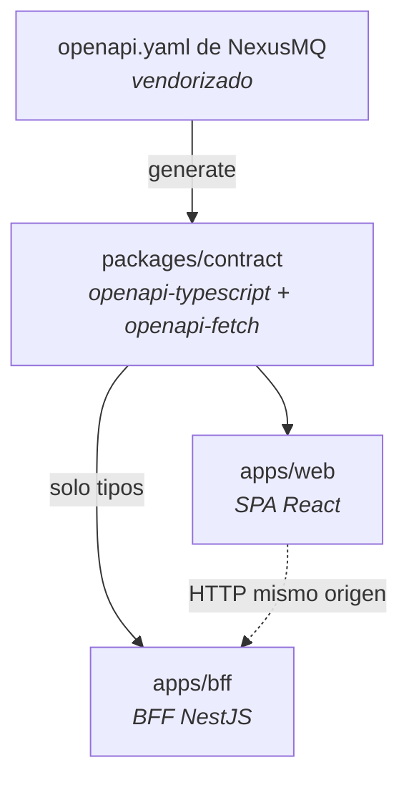
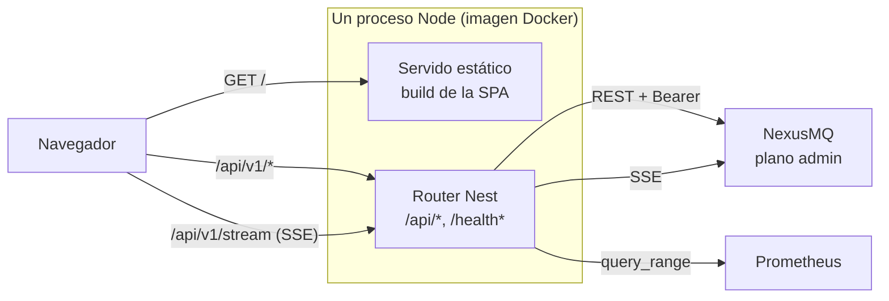
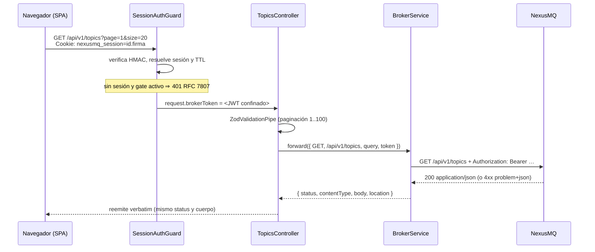

# 4. Vista de conjunto

> El sistema a vista de pájaro: los tres paquetes, cómo fluyen sus dependencias, qué recorre
> una petición de punta a punta y cómo se orquesta el monorepo. Es el mapa que sitúa los
> capítulos siguientes.

## 4.1 Tres paquetes y una dirección de dependencia

El repositorio es un monorepo **pnpm workspaces + Turborepo** con tres paquetes:

```
apps/web            SPA React (Vite)          → depende de contract
apps/bff            BFF NestJS (Express)      → depende de contract (solo tipos)
packages/contract   tipos + cliente generados → no depende de nada del proyecto
```

La regla es la misma que en el broker, trasladada a TypeScript: **las dependencias apuntan
hacia el contrato**. `packages/contract` no conoce ni a la SPA ni al BFF; ambos lo consumen.
No hay dependencia entre `apps/web` y `apps/bff` — se comunican por HTTP, no por
`import`, y su acoplamiento es exactamente el contrato REST que el BFF expone.



En el BFF el contrato entra **solo como tipos**: el proxy usa el `fetch` de undici en modo
*passthrough*, no el cliente `openapi-fetch`. La razón está en el
[capítulo 7](./07-arquitectura-bff.md).

## 4.2 Topología de ejecución

En **producción** hay un único proceso Node: el BFF. Sirve la SPA ya construida como
ficheros estáticos y expone la API en el mismo origen. El broker y Prometheus son externos y
se apuntan por variables de entorno.



En **desarrollo** son dos procesos: Vite sirve la SPA con HMR en su puerto y proxya `/api/*`
al BFF, que corre aparte con `nest start --watch`. El servido estático del BFF es un *no-op*
si `WEB_DIST_PATH` no apunta a un directorio con `index.html`, así que el mismo código vale
para ambos modos sin ramas condicionales.

## 4.3 Mismo origen, sin CORS

Decisión estructural: **la SPA y la API comparten origen**. El BFF no habilita CORS en
ningún caso. Esto no es una simplificación, es una propiedad de seguridad:

- la cookie de sesión viaja sin necesitar `SameSite=None`;
- el navegador bloquea por sí solo cualquier lectura desde otro origen;
- la CSP puede anclarse a `'self'` sin excepciones para `connect-src`.

El coste es que la consola debe desplegarse detrás de un único *hostname*. Es un coste que se
acepta sin discusión: el capítulo [13](./13-seguridad.md) explica lo que compra.

## 4.4 Recorrido de una petición

Seguir una lectura de topics de punta a punta muestra dónde vive cada responsabilidad:



Cinco propiedades salen de este diagrama:

1. **El guard es global**, pero solo actúa sobre rutas marcadas con `@Protected()`.
2. **La validación ocurre en el borde**, con Zod y allow-list, antes de tocar la red.
3. **El token se inyecta server-side**; el navegador nunca lo ve.
4. **La respuesta del broker se reemite tal cual**: mismo status, mismo `Content-Type`, mismo
   cuerpo, incluido `Location` al crear. El BFF no reinterpreta el dominio del broker.
5. **El único error que el BFF fabrica** en este camino es el 502 de "broker inaccesible" y
   el 400 de validación; todo lo demás es del broker.

## 4.5 Mapa de módulos del BFF

| Módulo | Responsabilidad |
| ------ | --------------- |
| `config` | Esquema Zod del entorno, validación *fail-fast*. Es `@Global()`. |
| `common` | `ProblemDetailsFilter` (RFC 7807), `ZodValidationPipe`, `sendProxyResult`. |
| `health` | `GET /health` propio del BFF (liveness, sin tocar el broker). |
| `broker` | `BrokerService` (proxy undici) + controllers de topics, groups, cluster y observabilidad. Es `@Global()`. |
| `auth` | Sesiones, cookie firmada, `SessionAuthGuard` global, detección del modo del broker. |
| `prometheus` | Data source de historia con allow-list de PromQL. |
| `stream` | Terminación de SSE con reconexión y backpressure. |

`BrokerModule` es `@Global()` y **no** importa `AuthModule`: así se rompe el ciclo que
aparecería si el módulo de auth (que necesita el broker para validar tokens) y el de broker
(que necesita el token de la sesión) se importaran mutuamente. El token llega al controller
por el decorador de parámetro `@BrokerToken()`, que lo lee de la petición donde lo dejó el
guard.

## 4.6 Mapa de carpetas de la SPA

`apps/web/src` está organizado **por feature**, no por tipo de fichero:

| Carpeta | Contenido |
| ------- | --------- |
| `app/` | Composición: router, shell (sidebar/topbar), proveedor de TanStack Query, tema. |
| `features/` | Una carpeta por dominio: `auth`, `topics`, `groups`, `cluster`, `dashboard`, `history`, `metrics`, `live`, `settings`, `viz`. |
| `routes/` | Un componente de página por ruta; monta features, no contiene lógica. |
| `components/ui/` | Primitivos de diseño reutilizables (`Button`, `Card`, `Dialog`, `Input`, `ProblemAlert`, `Spinner`). |
| `lib/` | Cliente del contrato, normalización de errores RFC 7807, utilidades. |
| `styles/` | `tokens.css` (fuente única de color) y estilos globales. |

Dentro de cada feature conviven su modelo puro (`.ts` sin React, testeable), sus hooks de
datos (`use-*.ts`) y sus componentes. Los módulos puros —`metrics-snapshot.ts`,
`history-range.ts`— concentran la lógica que merece pruebas unitarias y no arrastran DOM.

## 4.7 Orquestación del monorepo

`turbo.json` declara el grafo de tareas:

| Tarea | Depende de | Notas |
| ----- | ---------- | ----- |
| `generate` | — | Entrada `openapi.yaml`, salida `src/generated/**`. |
| `build` | `^build`, `generate` | Salida `dist/**`. |
| `typecheck` | `^build`, `generate` | Sin los tipos generados no hay typecheck válido. |
| `test` | `^build`, `generate` | Idem. |
| `dev` | — | `persistent`, sin caché, con `passThroughEnv` explícito. |

El `passThroughEnv` de `dev` no es cosmético: Turborepo 2.x usa *env-mode* estricto y filtra
las variables no declaradas. Sin él, el BFF arrancaba con el entorno vacío y abortaba en la
validación de configuración. Las nueve variables que necesita están declaradas ahí.
