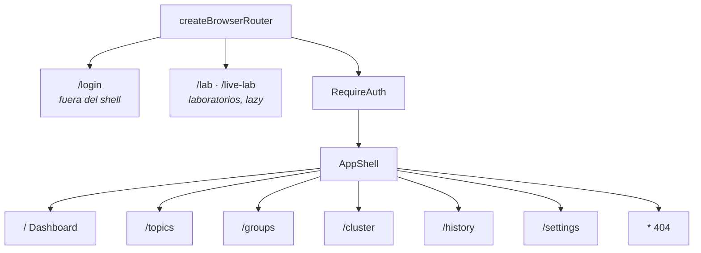

# 6. Arquitectura del frontend

> Cómo está construida la SPA: stack, organización por features, enrutado, guard de acceso,
> gestión de estado y datos, y el sistema de diseño que la sostiene.

## 6.1 Stack y por qué

| Pieza | Elección | Razón |
| ----- | -------- | ----- |
| Framework | **React 19** | Ecosistema de visualización más rico; el proyecto necesita ECharts, uPlot, visx y react-three-fiber conviviendo. |
| Bundler | **Vite 8** | Arranque instantáneo, HMR real, *code splitting* por `import()` sin configuración. |
| Estilos | **Tailwind v4** (CSS-first) | Los tokens viven en CSS (`@theme inline`), no en un `tailwind.config.js`; el tema se conmuta reasignando variables en un único fichero. |
| Primitivos | **Radix UI** | Diálogo, tooltip y toggle-group accesibles de serie (foco atrapado, `Escape`, ARIA). No se reimplementa accesibilidad. |
| Enrutado | **React Router 7** (data router) | Permite añadir *loaders*/acciones más adelante sin reestructurar. |
| Datos | **TanStack Query** | Caché, invalidación, reintentos y estados de carga/error resueltos; el hueco exacto que deja `openapi-fetch`. |
| Iconos | **lucide-react** | Consistente y tree-shakeable; los iconos son parte del sistema de estado, no decoración. |

## 6.2 Organización por feature

`src/` se divide por **dominio**, no por tipo de artefacto:

```
app/         router, shell (sidebar + topbar), QueryProvider, ThemeProvider
features/    auth · topics · groups · cluster · dashboard · history
             metrics · live · settings · viz
routes/      una página por ruta; monta features, sin lógica propia
components/  ui/ — primitivos de diseño (Button, Card, Dialog, Input, ProblemAlert, Spinner)
lib/         api-client (contrato → BFF), problem (RFC 7807), cn
styles/      tokens.css (fuente única de color), global.css
```

Dentro de una feature conviven tres tipos de fichero, y la separación es deliberada:

- **modelo puro** (`metrics-snapshot.ts`, `history-range.ts`, `format.ts`) — funciones sin
  React ni red. Es donde vive la lógica que merece pruebas unitarias.
- **hooks de datos** (`use-topics.ts`, `use-live-metrics.ts`, `use-cluster.ts`) — adaptadores
  entre el modelo puro, TanStack Query y el ciclo de vida del componente.
- **componentes** (`topics-table.tsx`, `stat-tile.tsx`) — presentación.

Un componente que calcula un cuantil es un error de capa; ese cálculo pertenece al modelo
puro, donde se puede probar sin montar un DOM.

## 6.3 Enrutado y guard de acceso



`/login` vive **fuera** del shell (no tiene sentido mostrar navegación a quien no ha
entrado). Los dos laboratorios —`/lab` (arsenal de visualización) y `/live-lab` (SSE con
fallback)— quedan también fuera del guard y se cargan con `lazy()`, para que ECharts y
three.js no entren en el *bundle* principal.

Todo lo demás pasa por `RequireAuth`, que resuelve el **estado de acceso** antes de montar
nada:

| Estado | Significado | Comportamiento |
| ------ | ----------- | -------------- |
| `authenticated` | Hay sesión de operador válida | Deja pasar. |
| `open` | El broker no exige auth y el gate está desactivado | Deja pasar sin login. |
| `locked` | Hace falta iniciar sesión | Redirige a `/login`, recordando la ruta de origen. |

Mientras resuelve muestra un *spinner* con etiqueta; si falla, un `ProblemAlert` con botón de
reintento. Nunca una pantalla en blanco.

## 6.4 Datos: TanStack Query sobre el cliente del contrato

Toda lectura de la API pasa por `apiClient`, el cliente `openapi-fetch` del contrato apuntado
a `window.location.origin` — es decir, **al BFF**, mismo origen. Al ser mismo origen, la
cookie `httpOnly` viaja sola con `credentials: 'same-origin'` y el JavaScript nunca la toca.

La política de reintentos del `QueryClient` codifica una distinción importante:

```ts
retry: (failureCount, error) => {
  if (error instanceof ProblemError && error.status >= 400 && error.status < 500) {
    return false;          // 4xx: determinista, reintentar no cambia nada
  }
  return failureCount < 2; // red o 5xx: transitorio, merece reintento
}
```

Reintentar un 401 solo consigue tres 401. Reintentar un fallo de red puede salvar la vista.

`staleTime` es de 5 s por defecto y `refetchOnWindowFocus` está desactivado: en una consola de
operación, un refresco inesperado al volver a la pestaña reordena tablas bajo el cursor.

**Las mutaciones nunca actualizan la caché de forma optimista.** Crear, alterar o borrar un
topic invalida las claves afectadas y **se relee del broker**. En un sistema distribuido, el
resultado real de una escritura puede no ser el que el cliente supuso; la única fuente de
verdad es lo que el broker responda después.

## 6.5 Estado: tres ámbitos, tres mecanismos

| Ámbito | Mecanismo | Ejemplo |
| ------ | --------- | ------- |
| Servidor (remoto) | TanStack Query | Lista de topics, describe de grupo, estado del clúster. |
| Flujo en vivo | `useLiveStream` + `useState` con ventana deslizante | Métricas del Dashboard (150 puntos). |
| Preferencias e interfaz | Contexto de React + `localStorage` | Tema claro/oscuro/sistema. |

No hay una tienda global de estado. No hace falta: cada dato tiene un dueño claro y el
acoplamiento entre features es mínimo.

El caso más interesante es el de las métricas en vivo. `useLiveMetrics` mantiene el frame
anterior en una `ref` y, por cada frame nuevo, **deriva** una muestra: las tasas por
diferencia de *counters* filtrados por etiqueta, y los cuantiles del histograma **del
intervalo** (diferencia de cubos acumulativos). La derivación es pura y está probada; el hook
solo orquesta. Ver [capítulo 11](./11-observabilidad-y-metricas.md).

## 6.6 Tema y sistema de diseño

El tema se conmuta con un atributo `data-theme` en el `:root`, y los tokens se declaran en
**dos ámbitos** para que el toggle del usuario gane siempre sobre la preferencia del sistema:

```css
:root { /* valores light */ }

@media (prefers-color-scheme: dark) {
  :root:where(:not([data-theme='light'])) { /* dark del sistema */ }
}

:root[data-theme='dark'] { /* dark por toggle: gana siempre */ }
```

El `:not([data-theme='light'])` es lo que permite que un usuario con el sistema en oscuro
fuerce el modo claro. Hay un script anti-FOUC en `index.html` que aplica el atributo antes del
primer *paint* — y ese script inline es, precisamente, el que la CSP habilita por *hash*
(ver [capítulo 13](./13-seguridad.md)).

Los componentes **no eligen color**: consumen roles (`bg-surface`, `text-foreground`,
`text-critical`) mapeados a los tokens vía `@theme inline`. Cambiar la paleta es tocar un
fichero.

## 6.7 Servido en desarrollo y en producción

En **desarrollo**, Vite sirve la SPA en el 5173 y proxya `/api`, `/health`, `/healthz` y
`/readyz` al BFF en el 3000. Así el navegador ve un solo origen también en local, y la cookie
de sesión se comporta igual que en producción.

En **producción**, `vite build` produce `dist/` y el BFF lo sirve (ver
[capítulo 7](./07-arquitectura-bff.md)). No hay servidor web adicional.

El *bundle* se divide con `import()` diferido en las rutas de laboratorio y en la topología
3D, que arrastra three.js. El resto de la aplicación entra en el chunk principal.

## 6.8 Accesibilidad

Verificada, no declarada:

- **Contraste AA (≥ 4.5:1)** del texto sobre página y sobre superficie, en claro y en oscuro,
  medido por una prueba Playwright sobre el DOM real.
- **Estado nunca solo por color**: el badge de conexión, el estado de un grupo, la tasa de
  error y los avisos llevan icono + texto.
- **Navegación anunciada**: el enlace activo del sidebar lleva `aria-current`.
- **Gráficas etiquetadas**: cada wrapper de visualización expone `role="img"` con una etiqueta
  descriptiva, y las leyendas nombran las series.
- **Diálogos accesibles** por Radix: foco atrapado, cierre con `Escape`, bloqueo de *scroll*.
