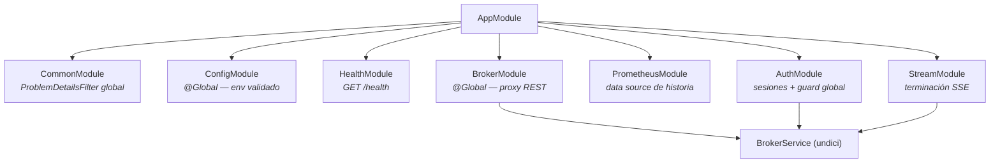
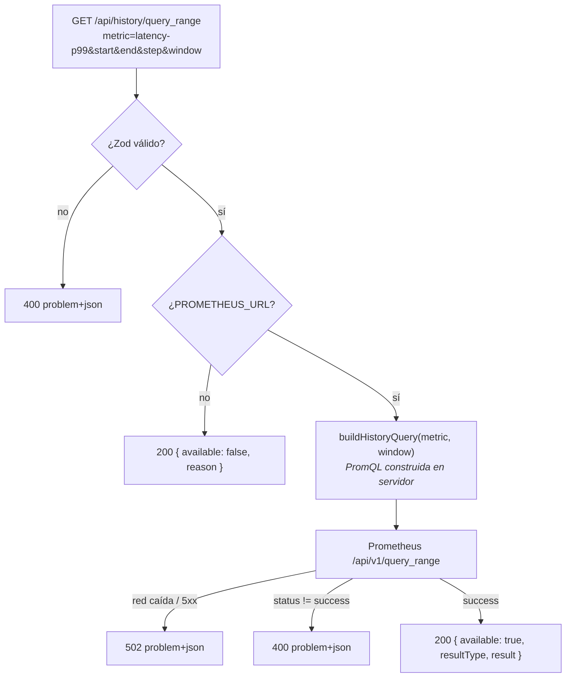

# 7. Arquitectura del BFF

> El servidor NestJS que es la frontera de confianza de la consola: sus módulos, el proxy
> *passthrough* al plano admin del broker, el data source de Prometheus, el servido de la SPA
> y el arranque.

## 7.1 Composición

`AppModule` compone siete módulos, cada uno con una responsabilidad y ninguno con lógica de
negocio del broker:



`BrokerModule` es `@Global()` y **no** importa `AuthModule`. Es la forma de romper un ciclo
real: `auth` necesita el broker para validar un token, y los controllers del broker necesitan
el token de la sesión. La dependencia se invierte con un decorador de parámetro —
`@BrokerToken()` — que lee el token de la petición, donde lo dejó el guard. `auth` depende de
`broker`; `broker` no depende de `auth`.

## 7.2 Tooling: por qué CommonJS y por qué undici

Dos decisiones del BFF se desvían del resto del monorepo, y ambas tienen razón:

**CommonJS.** `apps/bff` emite CommonJS mientras `apps/web` y `packages/contract` son ESM.
NestJS depende de `reflect-metadata` y de `emitDecoratorMetadata` para su DI por constructor,
y ese camino es el idiomático y el mejor soportado en CJS. Forzar ESM habría añadido fricción
sin ganancia. En los tests, la metadata de decoradores la produce `unplugin-swc`.

**`fetch` de undici, no `openapi-fetch`.** El contrato entra en el BFF **solo como tipos**. El
proxy es *passthrough*: no interpreta el cuerpo, lo reemite. Un cliente tipado que parsea la
respuesta sería trabajo desperdiciado —y una oportunidad de divergencia. Además, undici da
acceso al `Dispatcher`, necesario para el criterio TLS configurable y para el *streaming* del
SSE.

## 7.3 El proxy: `BrokerService.forward()`

Un único método concentra todo el diálogo con el broker:

```ts
async forward(options: ForwardOptions): Promise<ProxyResult>
```

Recibe método, ruta, *query*, cuerpo y token opcional; devuelve `{ status, contentType, body,
location }` — la respuesta **capturada, no interpretada**. El controller la reemite con
`sendProxyResult`.

Detalles que importan:

- **`Accept: application/json, application/problem+json`** en toda petición: se aceptan
  explícitamente los dos formatos que el broker puede devolver.
- **`Authorization: Bearer …`** solo si hay token. En modo abierto no se envía nada.
- **TLS configurable**: si `BROKER_TLS_REJECT_UNAUTHORIZED=false`, se construye un `Agent` de
  undici propio con `rejectUnauthorized: false`. En el caso estricto (por defecto) se usa el
  dispatcher global, sin crear objetos innecesarios.
- **Un único modo de fallo propio**: si `fetch` lanza (DNS, red, TLS, *timeout*), se convierte
  en `BrokerUnreachableError`, que el filtro global traduce a **502**. Cualquier respuesta del
  broker —incluidos 4xx y 5xx— **no** es un error del BFF y viaja intacta.

## 7.4 Controllers de proxy

Cinco controllers cubren el plano admin, todos con la misma forma:

| Controller | Rutas | Protegido |
| ---------- | ----- | --------- |
| `TopicsController` | `GET/POST /api/v1/topics`, `GET/PATCH/DELETE /api/v1/topics/{name}` | Sí |
| `GroupsController` | `GET /api/v1/groups`, `GET /api/v1/groups/{id}` | Sí |
| `ClusterController` | `GET /api/v1/cluster` | Sí |
| `ObservabilityController` | `GET /healthz`, `GET /readyz`, `GET /api/v1/metrics/snapshot` | Solo el snapshot |
| `StreamController` | `GET /api/v1/stream` | No (ruta abierta, como en el contrato) |

`healthz` y `readyz` quedan abiertos porque son *probes* de orquestador: pedirle a Kubernetes
que inicie sesión para comprobar la salud no tiene sentido. El **snapshot de métricas sí está
protegido** — lo pasó a `@Protected` la fase 5, al detectarse que era alcanzable sin sesión
incluso con el broker en modo secreto. Era una fuga de información operativa.

## 7.5 Validación en el borde

Toda entrada del cliente se valida con Zod antes de tocar la red, mediante `ZodValidationPipe`
aplicado **por parámetro** (`@Query(pipe)`, `@Body(pipe)`, `@Param(pipe)`) en lugar de un pipe
global sobre DTOs. Mantiene los controllers finos y hace explícito qué se valida en cada punto.

| Entrada | Regla |
| ------- | ----- |
| Paginación | `page` ≥ 1, `size` en `[1, 100]`. |
| Nombre de topic | Obligatorio, no vacío. |
| `PATCH` de topic | `.strict()`: rechaza claves fuera del contrato (p. ej. `segmentBytes`). |
| `query_range` | `metric` de un `enum` cerrado; `start`/`end` en segundos Unix; `step`/`window` duraciones Prometheus estrictas. |
| Login | `.strict()`: solo el token. |

Un fallo de validación lanza `BadRequestException` con el detalle por propiedad, que el filtro
global convierte en un `problem+json` con `issues`.

## 7.6 Data source de Prometheus

`PrometheusService.queryRange()` expone la historia con **degradación limpia** como
comportamiento de primera clase:



Que "no hay Prometheus" responda **200 con `available: false`** y no un error es intencionado:
no es un fallo, es una configuración. La SPA lo distingue y muestra un aviso honesto en lugar
de una pantalla de error.

La construcción de la PromQL en servidor se detalla en el
[capítulo 11](./11-observabilidad-y-metricas.md); es también una decisión de seguridad
([capítulo 13](./13-seguridad.md)).

## 7.7 Servido de la SPA

En producción el BFF sirve el build estático, registrado sobre el Express subyacente **antes**
del router de Nest:

1. `express.static(root, { index: false, fallthrough: true })` — entrega los ficheros reales
   (JS, CSS, assets). Con `fallthrough`, lo que no existe continúa.
2. **Fallback SPA** — las `GET` que no son rutas del BFF devuelven `index.html`, para que los
   *deep links* funcionen al recargar.

La guarda es una función explícita:

```ts
function isBffRoute(path: string): boolean {
  return path.startsWith('/api/') || path === '/health'
      || path === '/healthz' || path === '/readyz';
}
```

Sin ella, un `GET /api/v1/inexistente` devolvería el HTML de la SPA con status 200 en lugar de
un 404 `problem+json`. Hay una prueba e2e que lo verifica.

Todo esto se activa **solo** si `WEB_DIST_PATH` apunta a un directorio con `index.html`. Si
no, es un *no-op* silencioso y en desarrollo la SPA la sirve Vite. Un mismo binario, dos
modos, sin ramas condicionales por entorno.

## 7.8 Arranque

`main.ts` es corto a propósito:

```ts
const app = await NestFactory.create(AppModule);
app.enableShutdownHooks();          // cierra conexiones y streams en SIGTERM/SIGINT
const config = app.get(ConfigService);
applySecurityHeaders(app, config);  // antes del estático y del router: cubre todo
applyStaticHosting(app, config);
await app.listen(config.port);
```

El orden importa. Las cabeceras de seguridad se registran **primero** para que cubran también
las respuestas del servido estático, no solo las del router. Y `enableShutdownHooks()` es lo
que permite que `AuthService.onModuleDestroy()` detenga el barrido de sesiones y que los SSE
en vuelo se cierren limpiamente en un despliegue rodante.

Cualquier fallo de arranque —típicamente una configuración inválida— se captura en el `catch`
del *bootstrap*, se registra con mensaje legible y **sale con código 1**.
