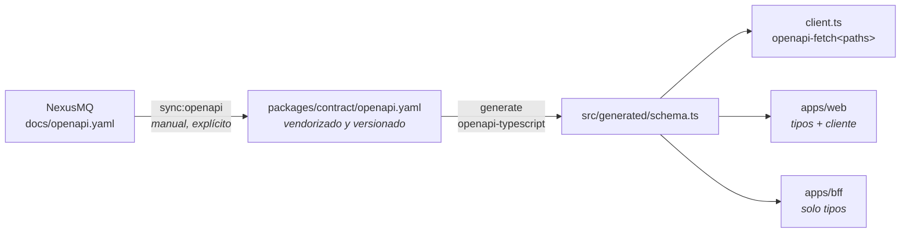

# 8. Contrato y tipos generados

> Cómo entra en la consola el contrato REST de NexusMQ, por qué está vendorizado, cómo se
> generan los tipos y qué hacer cuando el broker cambia. La regla de oro: **el contrato nunca
> se escribe a mano**.

## 8.1 El paquete `packages/contract`

Un único paquete traduce el OpenAPI del broker a TypeScript, y todo el resto de la consola lo
consume:

```
packages/contract/
├── openapi.yaml              ← vendorizado del broker (fuente de verdad)
├── scripts/sync-openapi.mjs  ← re-descarga el YAML del repositorio del broker
├── src/
│   ├── generated/schema.ts   ← GENERADO (en .gitignore)
│   ├── client.ts             ← createNexusMqClient (openapi-fetch tipado)
│   └── index.ts              ← superficie pública del paquete
```

Exporta exactamente tres cosas: el creador de cliente, sus tipos de opciones y los tipos
generados (`paths`, `components`, `operations`, `webhooks`).

## 8.2 El pipeline de generación



Dos pasos, deliberadamente separados:

- **`sync:openapi`** descarga el `openapi.yaml` desde el *raw* de GitHub del broker
  (sobrescribible con `NEXUSMQ_OPENAPI_URL` para apuntar a un fork o a otra rama) y lo escribe
  en el paquete. Es **manual**: actualizar el contrato es una decisión, no un efecto colateral
  de un build.
- **`generate`** ejecuta `openapi-typescript openapi.yaml -o src/generated/schema.ts`. Es
  **automático**: Turborepo lo encadena antes de `build`, `typecheck` y `test`.

## 8.3 Por qué vendorizado

Copiar el YAML al repositorio en lugar de descargarlo en cada build compra tres propiedades:

| Propiedad | Consecuencia |
| --------- | ------------ |
| **Build reproducible** | El mismo commit produce siempre los mismos tipos, hoy y dentro de un año. |
| **Independencia de la red** | El CI no falla porque GitHub esté lento o el repositorio del broker se mueva. |
| **Cambio de contrato visible** | Actualizar el contrato produce un *diff* revisable en el historial: se ve exactamente qué cambió y cuándo. |

El coste es que hay que acordarse de sincronizar. Se acepta: un contrato que cambia bajo los
pies sin que nadie lo note es peor problema que uno que se actualiza tarde.

## 8.4 Qué cubre el contrato

El `openapi.yaml` (versión 1.0.0) define las rutas del plano de operación y sus esquemas:

| Ruta | Uso en la consola |
| ---- | ----------------- |
| `GET /healthz`, `GET /readyz` | Sondas de vida y preparación (proxied, abiertas). |
| `GET /metrics` | Formato Prometheus; **no** lo consume la consola — lo consume Prometheus. |
| `GET /api/v1/metrics/snapshot` | Snapshot JSON estructurado; alimenta el Dashboard. |
| `GET/POST /api/v1/topics` · `GET/PATCH/DELETE /api/v1/topics/{name}` | Vista de Topics (CRUD + retención). |
| `GET /api/v1/groups` · `GET /api/v1/groups/{id}` | Vista de Grupos (lista + describe con lag). |
| `GET /api/v1/cluster` | Estado Raft, nodos y particiones; Dashboard, Cluster y Particiones. |
| `GET /api/v1/stream` | SSE de métricas; lo termina el BFF. |

Los esquemas relevantes —`TopicSummary`, `TopicDescription`, `PartitionInfo`, `GroupSummary`,
`GroupDescription`, `GroupPartitionOffset`, `NodeInfo`, `PartitionRaftInfo`,
`FollowerProgress`, `ClusterInfo`, `MetricSample`, `MetricsSnapshot`, `ProblemDetail`— se usan
por referencia desde ambos lados. Por ejemplo, el modelo de error de la SPA es literalmente:

```ts
export type ProblemDetail = components['schemas']['ProblemDetail'];
```

Autenticación: `bearerAuth` (JWT HS256), exigido solo si el nodo arrancó con `--jwt-secret`.
El contrato **no define ninguna ruta que acuñe tokens** — un hecho con consecuencias
arquitectónicas grandes, desarrolladas en el [capítulo 9](./09-autenticacion-y-sesiones.md).

## 8.5 Dónde el contrato **no** llega

Hay dos superficies que el OpenAPI no cubre, y ambas están documentadas como tales en el
código:

**Los nombres de las métricas.** `MetricsSnapshot` es una **lista abierta** de `MetricSample`
con `name` libre estilo Prometheus. El contrato fija la *forma*, no los *nombres*. Estos viven
en el catálogo `docs/metrics.md` del broker. Esta brecha causó el fallo más caro del proyecto
(ver [capítulo 2](./02-contexto-y-motivacion.md) y
[capítulo 11](./11-observabilidad-y-metricas.md)); la mitigación es que los tres módulos que
fijan nombres llevan un `@see` clicable a ese catálogo.

**La API propia del BFF.** `/api/auth/*` y `/api/history/*` son del BFF, no del broker, y por
tanto no están en el OpenAPI de NexusMQ. Sus tipos se declaran a mano **a propósito**, y el
código lo dice explícitamente:

```ts
// Nota de contrato: la forma `query_range` es del BFF (su data source de
// Prometheus), no del OpenAPI del broker, así que estos tipos se declaran a
// mano a propósito (no son tipos del contrato).
```

Distinguir "esto es del contrato" de "esto es nuestro" evita que alguien busque en el YAML un
esquema que nunca estuvo ahí.

## 8.6 El cliente tipado

`createNexusMqClient` es una envoltura mínima de `openapi-fetch` que fija `baseUrl` como
obligatoria:

```ts
export type NexusMqClient = Client<paths>;
export const createNexusMqClient = (o: CreateNexusMqClientOptions): NexusMqClient =>
  createClient<paths>(o);
```

En la SPA se instancia **una sola vez**, apuntando a `window.location.origin` — al BFF, mismo
origen. Al ser mismo origen, la cookie `httpOnly` viaja sola y el JavaScript no la toca.

`openapi-fetch` devuelve `{ data, error, response }` en lugar de lanzar. La consola convierte
eso en excepciones en un único punto (`unwrap` / `unwrapVoid` en `lib/problem.ts`), donde
también se normaliza el error a `ProblemDetail`. Ver [capítulo 14](./14-modelo-de-errores.md).

En el BFF **no se usa el cliente**, solo los tipos: el proxy es *passthrough* con undici. Un
cliente que parsea la respuesta no aportaría nada a un proxy que no la interpreta.

## 8.7 Procedimiento cuando el broker cambia

```bash
pnpm --filter @nexusmq/contract sync:openapi   # trae el YAML nuevo
pnpm generate                                   # regenera los tipos
pnpm typecheck                                  # aquí salen las roturas
```

El `typecheck` es el detector: cada punto que usaba un campo renombrado o eliminado falla al
compilar. Se arreglan, se corren los tests y se revisa el *diff* del YAML por si hay cambios
semánticos que los tipos no capturan (una etiqueta nueva, un enum ampliado).

Si el cambio afecta a **nombres de métrica**, el `typecheck` **no** lo detectará —son cadenas—
y hay que revisar el catálogo del broker y los tres módulos anclados a él. Está señalizado en
el código y repetido aquí porque es la trampa conocida del proyecto.

`src/generated/` está en `.gitignore` a propósito: no se versiona un artefacto derivado, y
así nadie puede editarlo a mano sin que el siguiente `generate` lo borre.
