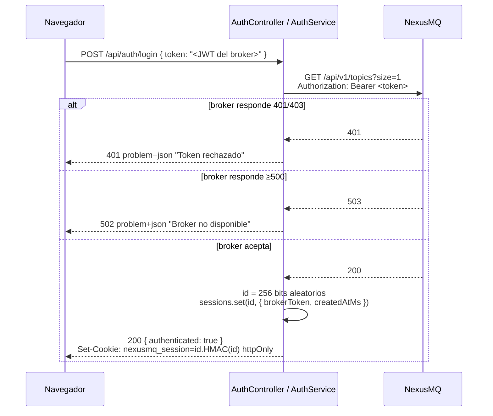
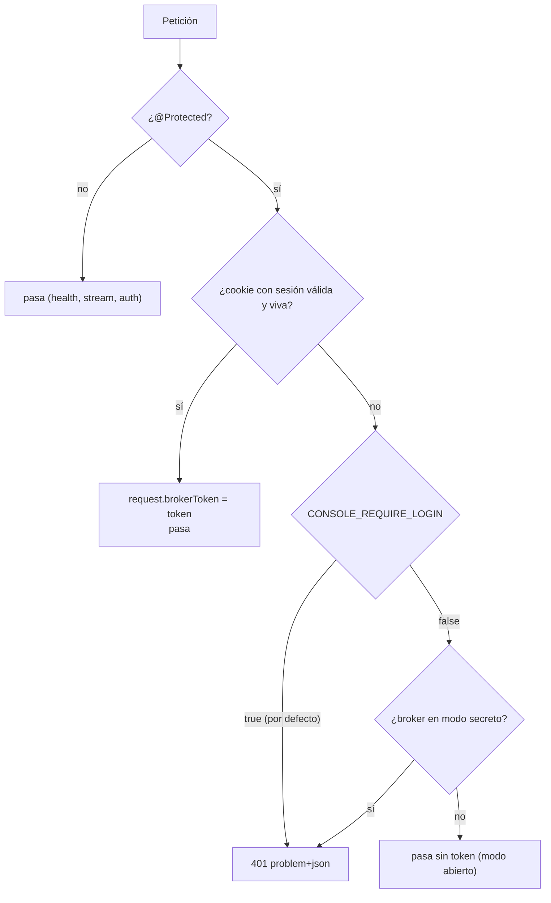

# 9. Autenticación y sesiones

> El modelo de acceso de la consola: por qué el operador "pega su token", cómo se confina en
> servidor, cómo se descubre el modo del broker sin conocer su secreto, y qué garantiza el
> gate de login. Es el capítulo con más consecuencias de seguridad del documento.

## 9.1 El hecho que lo condiciona todo

El contrato de NexusMQ define `bearerAuth` (JWT HS256) y lo exige **solo si el nodo arrancó
con `--jwt-secret`**. Pero el OpenAPI **no define ninguna ruta que acuñe tokens**: no hay
`POST /login` en el broker. Los JWT se emiten fuera, por quien custodia el secreto.

Esto descarta el flujo de login habitual —usuario y contraseña contra el backend— y obliga a
un modelo distinto: **el operador pega un JWT ya emitido**. La consola no es una autoridad de
identidad, y no pretende serlo.

De aquí sale la propiedad más importante del diseño: **el BFF nunca conoce el secreto HS256
del broker**. No puede firmar tokens, no puede verificarlos criptográficamente y no puede
suplantar a nadie. Solo puede *usarlos* y *preguntarle al broker* si valen.

## 9.2 El flujo de login



El token se valida **usándolo de verdad** contra un endpoint protegido barato
(`GET /api/v1/topics?size=1`). Si el broker lo acepta, vale; si no, no. No hay verificación
local que pudiera divergir del criterio real del broker.

A partir de ahí, el token vive en un `Map` en memoria del BFF y **jamás** vuelve al navegador.

## 9.3 La cookie: una clave opaca, no un contenedor de datos

```
nexusmq_session = <id en hex de 256 bits> . <HMAC-SHA256(id, SESSION_SECRET) en base64url>
```

| Atributo | Valor | Por qué |
| -------- | ----- | ------- |
| `httpOnly` | sí | El JavaScript de la página no puede leerla; un XSS no se lleva la sesión. |
| `SameSite` | `Lax` | Bloquea el envío en peticiones cross-site de escritura (CSRF). |
| `Secure` | en producción | Solo viaja por HTTPS. En desarrollo se desactiva para poder probar sobre `http://127.0.0.1`. |
| `path` | `/` | La SPA y la API comparten origen. |
| `maxAge` | `SESSION_TTL_HOURS` | Alineado con el TTL del servidor: no hay cookies que sobrevivan a su sesión. |

La cookie **no transporta datos**, solo la clave. La firma HMAC no protege confidencialidad
(no hay nada que ocultar en un id aleatorio); sirve para **descartar cookies manipuladas antes
de tocar el almacén**, y se verifica en **tiempo constante** con `timingSafeEqual`.

## 9.4 Detección del modo del broker: sondeo, no configuración

El BFF necesita saber si el broker exige auth, pero no puede deducirlo de su configuración
(no la conoce) ni del contrato (dice "depende"). Lo **sondea**:

```ts
const result = await this.broker.forward({ method: 'GET', path: PROBE_PATH, query: { size: 1 } });
this.authRequired = result.status === 401 || result.status === 403;
```

Una petición **sin token** a una ruta protegida: `401`/`403` significa *modo secreto*; `2xx`
significa *modo abierto*.

El resultado se cachea con un **TTL de 60 s**. El TTL no es una optimización: es lo que
permite que, si el broker **se reinicia en otro modo**, la consola lo re-detecte sin reiniciar
el BFF. Un valor cacheado para siempre habría sido un bug latente esperando a un despliegue.

## 9.5 El guard: cuatro caminos

`SessionAuthGuard` es global (`APP_GUARD`) pero solo actúa donde hay `@Protected()`:



El token confinado se entrega al controller mediante el decorador de parámetro
`@BrokerToken()`, que lo lee de la petición. El controller nunca sabe de dónde salió.

## 9.6 El gate de login (`CONSOLE_REQUIRE_LOGIN`)

Por defecto **`true`, en todos los entornos**. Con él activo, las rutas `@Protected` exigen
sesión **siempre**, aunque el broker esté en modo abierto.

La alternativa —espejar el modo del broker— parecía elegante y era un error: un broker en modo
abierto convertía la consola en un panel de operación **sin ninguna autenticación**, accesible
a cualquiera que alcanzara su URL. Que el broker no exija credenciales no significa que
publicar su estado y sus mutaciones deba ser libre. Son dos decisiones distintas, y ahora se
toman por separado.

`CONSOLE_REQUIRE_LOGIN=false` restaura el comportamiento anterior; existe para el desarrollo
local y para despliegues donde otra capa ya autentica.

El mecanismo de login **no cambia** con el gate: sigue siendo el token del broker confinado en
servidor. No se introduce una credencial de consola nueva, porque eso crearía una segunda
autoridad de identidad que habría que custodiar.

## 9.7 Ciclo de vida de la sesión: TTL y purga

Una sesión tiene `createdAtMs` y vive `SESSION_TTL_HOURS` (8 h por defecto). La caducidad se
aplica por dos vías complementarias:

- **Perezosa**, en `resolveToken()`: una sesión vencida se **borra del `Map`** y se trata como
  inexistente, sin esperar a nada. El operador ve un 401 y vuelve a entrar.
- **Periódica**, con un `setInterval` arrancado en `onModuleInit()` a cadencia
  `min(TTL, 10 min)`. Purga las vencidas aunque nadie las consulte, para que el `Map` no crezca
  con sesiones abandonadas.

El temporizador lleva `unref()` —no mantiene vivo el proceso por sí solo— y se limpia en
`onModuleDestroy()`, que se invoca gracias al `enableShutdownHooks()` del arranque.

## 9.8 Endpoints de sesión

| Endpoint | Devuelve | Nota |
| -------- | -------- | ---- |
| `POST /api/auth/login` | `{ authenticated: true }` + `Set-Cookie` | El cuerpo se valida con `.strict()`: solo el token. |
| `POST /api/auth/logout` | `{ authenticated: false }` + `clearCookie` | Idempotente: sin sesión, no falla. |
| `GET /api/auth/session` | `{ authenticated: boolean }` | **Lo único** que el navegador necesita saber. |

Ninguno devuelve el token, ni su longitud, ni sus *claims*, ni el destino del broker.

## 9.9 El lado del cliente

La SPA deriva un **estado de acceso** de tres valores, combinando la sesión con el
comportamiento observado del BFF:

```ts
async function resolveAccess(): Promise<AccessState> {
  const session = await fetchSession();
  if (session.authenticated) return 'authenticated';
  return probeAccess();        // sondea una ruta protegida: 401 ⇒ 'locked'
}
```

`probeAccess` es lo que hace que la SPA **se adapte sola** al gate: si el BFF exige login, la
ruta protegida responde 401 y el estado pasa a `locked`, sin que el cliente tenga que conocer
el valor de `CONSOLE_REQUIRE_LOGIN`. La configuración del servidor no se filtra al navegador;
se **deduce de su comportamiento**.

Ese estado alimenta el guard `RequireAuth`, el indicador de conexión de la topbar y la tarjeta
de sesión de Ajustes, desde la que también se puede cerrar sesión.

## 9.10 Qué está verificado

La no-fuga del token no se afirma, se prueba. Las pruebas e2e del BFF comprueban, sobre
respuestas reales, que el JWT del broker **no aparece** en el cuerpo, ni en las cabeceras, ni
en la cookie, en ninguno de los caminos de login, proxy y sesión. Además se cubren:

- 401 sin sesión en ruta protegida (modo secreto);
- login con token inválido → 401; con token válido → sesión y proxy funcionando;
- modo abierto con el gate desactivado → paso sin login;
- gate activo sobre broker abierto → 401 en `topics` y en `metrics/snapshot`, y 200 tras login;
- sesión fresca resuelve; sesión vencida da 401 y **sale del `Map`**;
- el sondeo del modo cachea dentro del TTL y **re-sondea** a los 61 s.
