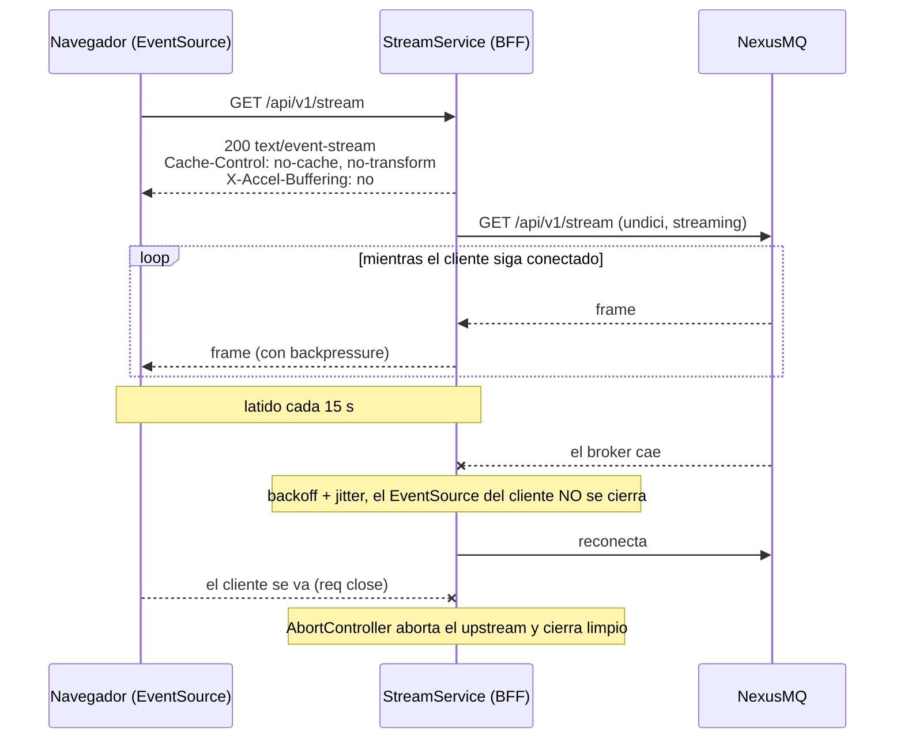

# 10. Tiempo real: terminación de SSE

> Cómo llega al navegador el flujo en vivo del broker: por qué SSE y no WebSocket, qué
> significa "terminar" un stream, cómo se reconecta sin tumbar al cliente, cómo se acota la
> memoria por conexión y qué pasa cuando el propio plano SSE deja de estar disponible.

## 10.1 SSE, no WebSocket

El broker expone `GET /api/v1/stream` como `text/event-stream`. La elección no es de la
consola, pero es la correcta para este caso:

- el flujo es **unidireccional** (servidor → cliente); no hay nada que el navegador quiera
  enviar por ese canal;
- SSE va **sobre HTTP normal**, así que hereda proxies, TLS, cabeceras y cookies sin
  infraestructura adicional;
- `EventSource` es una API del navegador con reconexión automática de serie.

Un WebSocket habría añadido un protocolo, un *handshake* de upgrade y gestión de estado
bidireccional para no usar ninguna de las dos direcciones extra.

## 10.2 Qué significa "terminar" el SSE

El navegador **no** abre un `EventSource` contra el broker. Abre uno contra el BFF, y es el
BFF quien mantiene su propia conexión al broker y **reemite** los frames.



Esta indirección compra tres cosas que un `EventSource` directo al broker no da:

1. **Mismo origen** — sin CORS, con la cookie de sesión y bajo la CSP `connect-src 'self'`.
2. **Estabilidad frente a caídas del broker** — el cliente no ve el corte.
3. **Un solo punto de control** — *timeouts*, backpressure y cierre ordenado en servidor.

## 10.3 Cabeceras y latido

```ts
response.setHeader('Content-Type', 'text/event-stream');
response.setHeader('Cache-Control', 'no-cache, no-transform');
response.setHeader('Connection', 'keep-alive');
response.setHeader('X-Accel-Buffering', 'no');
response.flushHeaders();
```

`no-transform` y `X-Accel-Buffering: no` existen por los proxies inversos: nginx bufferiza
respuestas por defecto y convertiría un flujo en tiempo real en ráfagas cada varios kilobytes.

Cada **15 s** se emite un comentario SSE (`: keep-alive`). Es invisible para la aplicación
—`EventSource` ignora los comentarios— y mantiene viva la conexión a través de balanceadores
con *idle timeout*.

## 10.4 Reconexión con backoff y jitter

El bucle de reenvío reintenta mientras el cliente siga conectado:

```ts
while (!clientSignal.aborted) {
  try {
    await this.streamOnce(response, clientSignal);
    attempt = 0;                     // cierre limpio del broker: reconecta desde el suelo
  } catch { /* se registra y se reintenta */ }
  if (clientSignal.aborted || !(await sleep(backoffDelayMs(attempt++, BACKOFF), clientSignal))) break;
}
```

| Parámetro | Valor | Razón |
| --------- | ----- | ----- |
| Retardo inicial | 500 ms | Suficiente para no martillear en un reinicio rápido. |
| Retardo máximo | 15 s | Techo: un broker caído no se sondea cada segundo indefinidamente. |
| *Jitter* | sí | Evita que N consolas reconecten en fase y produzcan una avalancha sincronizada. |
| Reseteo | tras cierre limpio | Un cierre normal del broker no debe heredar el backoff de un fallo anterior. |

Lo esencial: **la respuesta al navegador nunca se cierra durante la reconexión**. El
`EventSource` del cliente no se entera de que el *upstream* se cayó y volvió.

## 10.5 Dos timeouts distintos

Un mismo `watchdog` cubre dos fases con semánticas diferentes:

- **Conexión (10 s)** — tope para *establecer* el upstream. Se limpia al recibir las
  cabeceras.
- **Inactividad (30 s)** — se **rearma con cada chunk**. Si el broker no emite nada en ese
  tiempo, se aborta y se reconecta.

El segundo es el que detecta conexiones **medio abiertas**: un socket que TCP considera vivo
pero por el que nunca llegará nada más. Sin él, un stream muerto parecería un stream tranquilo.

## 10.6 Backpressure acotado

Es la parte menos visible y la más importante para la estabilidad.

Reemitir cada chunk con `response.write()` **sin mirar su valor de retorno** deja que Node
acumule sin límite en el buffer del socket cuando el cliente es más lento que la fuente. La
memoria por conexión crece sin cota: un operador con una pestaña en segundo plano y una red
mala puede tumbar el proceso.

La solución respeta el contrato de los streams de Node:

```ts
if (response.write(chunk)) return Promise.resolve();  // cupo: seguimos
return new Promise((resolve) => {                     // no cupo: esperamos a 'drain'
  response.once('drain', settle);
  response.once('close', settle);
  response.once('error', settle);
  signal.addEventListener('abort', settle, { once: true });
});
```

Y el bombeo espera esa promesa entre chunk y chunk, con lo que **la lectura del upstream se
pausa** hasta que el socket del cliente drene. El backpressure se propaga hasta el broker: si
el operador no puede consumir, el BFF no pide más.

Los cuatro *listeners* (`drain`, `close`, `error`, `abort`) están ahí para que la promesa
**siempre** se resuelva. Esperar solo a `drain` cuelga el bucle para siempre si el cliente se
desconecta con el buffer lleno.

Está verificado con seis pruebas deterministas, entre ellas la que importa: **cliente lento ⇒
solo se lee un chunk del upstream**, no se acumula sin límite.

## 10.7 Cierre limpio

Cuando el navegador cierra la pestaña, Express emite `close` en la petición. El BFF:

1. aborta el `AbortController` del cliente, lo que aborta el `fetch` al broker;
2. rompe el bucle de reconexión;
3. limpia el latido;
4. cierra la respuesta si sigue abierta.

Hay una prueba e2e que lo comprueba desde el otro lado: al irse el cliente, el doble del
broker registra **cero** conexiones upstream activas. Sin esto, cada pestaña cerrada dejaría
un stream huérfano consumiendo el broker.

## 10.8 El lado del cliente: fallback a polling

`useLiveStream` abre el `EventSource` y expone `{ data, status, source, lastUpdatedAtMs }`.
Cuando el SSE falla —error fatal (`readyState === CLOSED`) o varios reintentos transitorios
seguidos— **cae a polling** del snapshot cada 4 s.

Detalle que define la calidad: **el último dato persiste** al cambiar de fuente. La UI no
parpadea a vacío; solo cambia el indicador de `en vivo` a `polling`. Un frame mal formado se
descarta sin tumbar la conexión; un fallo puntual del snapshot se señaliza y se reintenta.

Merece precisión sobre **qué cubre** este fallback. El SSE del BFF ya es resiliente a las
caídas del broker (§10.4), así que un corte del broker **no** tumba este `EventSource`. Lo que
el fallback cubre es que el **propio plano SSE del BFF** deje de estar disponible —proxy que
corta streams largos, red del cliente que no tolera conexiones persistentes. Por eso el fallo
se provoca, en las pruebas, en el salto SPA → BFF.

Todo el camino está verificado en navegador full-stack: push en vivo con el BFF reemitiendo
los frames del doble del broker, caída a polling al forzar el fallo, y vuelta a vivo al
restaurar.
