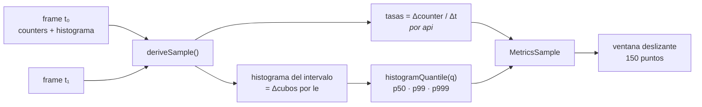

# 11. Observabilidad y métricas

> De dónde salen los números que muestra la consola: el snapshot en vivo del broker, cómo se
> derivan tasas y percentiles en el cliente, cómo se ancla la consola al catálogo real de
> métricas, y cómo se consulta la historia en Prometheus con una allow-list de PromQL.

## 11.1 Dos fuentes, dos horizontes

| Fuente | Horizonte | Ruta | Vista |
| ------ | --------- | ---- | ----- |
| Snapshot del broker (SSE + polling) | **Ahora** — segundos | `/api/v1/stream`, `/api/v1/metrics/snapshot` | Dashboard |
| Prometheus (`query_range`) | **Historia** — 15 min a 24 h | `/api/history/query_range` | Historia |

La separación es deliberada y es también un no-objetivo: **la consola no almacena series**.
Para el instante consulta al broker; para el pasado, a Prometheus, que es quien tiene ese
trabajo. Reimplementar una TSDB estaba fuera de alcance desde el primer día.

## 11.2 El catálogo real del broker

El `MetricsSnapshot` del contrato es una **lista abierta** de muestras con `name` libre. El
OpenAPI fija la forma, no los nombres. Los nombres viven en el catálogo `docs/metrics.md` del
broker, y son estos:

| Familia | Tipo | Etiquetas | Significado |
| ------- | ---- | --------- | ----------- |
| `nexus_broker_requests_total` | counter | `{api, protocol}` | Peticiones del plano de datos servidas. |
| `nexus_broker_request_errors_total` | counter | `{api, protocol}` | Peticiones con error de wire. |
| `nexus_broker_request_bytes_total` | counter | `{api, protocol}` | Bytes de payload. |
| `nexus_broker_messages_total` | counter | `{api, protocol}` | Records (mensajes). |
| `nexus_broker_request_duration_seconds` | histogram | `{api, protocol}` | Latencia de servicio. |
| `nexus_broker_connections_active` | gauge | `{plane}` | Conexiones de cliente activas. |

`api` toma `produce` o `fetch`; `protocol`, `native` o `kafka`; `plane`, `native`, `kafka` o
`admin`.

> **La trampa que costó una fase entera.** Durante las fases 1–4 la consola asumió nombres
> plausibles (`nexusmq_messages_in_total`…) y los dobles de prueba emitían exactamente esos.
> Todos los tests pasaban; contra el broker real, el Dashboard salió vacío. El
> [capítulo 2](./02-contexto-y-motivacion.md) cuenta la lección; aquí queda su mitigación:
> los **tres** módulos que fijan nombres —`metrics-snapshot.ts` (Dashboard),
> `history-range.ts` (ids del cliente) y `history-metrics.ts` (constructor de PromQL en
> servidor)— llevan un `@see` clicable al catálogo del broker. Si el catálogo cambia, el punto
> a tocar está señalizado.

## 11.3 Filtrado por etiqueta y agregación

Como cada familia viene **desglosada por etiquetas**, no basta con buscar por nombre: hay que
filtrar, y a veces agregar. El modelo puro implementa el equivalente cliente de PromQL:

| Función | Equivalente PromQL | Comportamiento |
| ------- | ------------------ | -------------- |
| `findCounter(s, name, {api})` | `sum(metric{api="…"})` | Suma las series que casan el selector. `null` si no hay ninguna. |
| `findGauge(s, name, sel)` | `sum(gauge{…})` | Idem para gauges. |
| `groupGaugeByLabel(s, name, 'plane')` | `sum(gauge) by (plane)` | Mapa `{etiqueta → suma}` ordenado. `null` si no hay serie. |
| `findHistogram(s, name, {api})` | `sum(histogram{api="…"}) by (le)` | Suma los cubos acumulativos por `le` sobre todas las series que casan. |

`findHistogram` merece explicación: sumar cubos **acumulativos** serie a serie da la
distribución acumulada agregada, que es exactamente lo que hace `sum(...) by (le)` en
Prometheus. Es lo que permite ver la latencia de `produce` sobre `native` **y** `kafka` como
una sola distribución.

Todas devuelven `null` —no `0`— cuando la serie no existe. Ese `null` se propaga hasta el
tile, que muestra «—». Ver [capítulo 5](./05-principios-de-diseno.md), §5.6.

## 11.4 Derivación en el cliente

El snapshot trae contadores acumulados y un histograma acumulado. Un dashboard necesita
**tasas** y **percentiles recientes**. La derivación ocurre en el cliente, por diferencia
entre el frame actual y el anterior:



Dos decisiones concretas:

**Tasas por diferencia de counters, con guardas.** `rate()` devuelve `null` si falta alguno de
los dos valores, si `Δt ≤ 0` o si **el counter retrocedió** (`curr < prev`) — señal de que el
broker se reinició. Un contador que baja produciría una tasa negativa absurda; es mejor un
hueco honesto.

**Cuantiles del histograma *del intervalo*, no del acumulado.** `deltaHistogram()` resta los
cubos del frame anterior a los del actual, y el cuantil se calcula sobre esa diferencia. Un
p99 calculado sobre el histograma desde el arranque del broker está dominado por lo que pasó
hace horas y no se mueve nunca; el del intervalo refleja **la latencia reciente**, que es la
que interesa mirar. Si aún no hay intervalo (primer frame), se usa el acumulado como respaldo.

`histogramQuantile` interpola linealmente dentro del cubo, igual que Prometheus, y trata el
cubo `+Inf` con cuidado: un cuantil que cae ahí devuelve el último `le` finito en lugar de
interpolar hacia infinito.

## 11.5 Lo que muestra el Dashboard

Seis tiles y dos gráficas en vivo:

| Tile | Contenido | Degrada si… |
| ---- | --------- | ----------- |
| **Produce** | req/s + `msg/s · bytes/s` | falta `messages_total` o `request_bytes_total`. |
| **Fetch** | req/s + `msg/s · bytes/s` | idem. |
| **Latencia p99** | p99 en ms + `p50 · p999` | no hay histograma de `produce`. |
| **Tasa de error** | err/s + % sobre peticiones, con icono de estado | falta `request_errors_total`. |
| **Conexiones activas** | total + desglose por `plane` | falta `connections_active`. |
| **Clúster** | nodos + salud + término, o particiones sin líder | `GET /api/v1/cluster` no responde. |

Las gráficas son **uPlot en streaming** (`setData` sin reconstruir el objeto) sobre la ventana
deslizante de 150 puntos. El estado del clúster **no viaja por el SSE**, así que se sondea
aparte con TanStack Query.

La tasa de error se muestra **en proporción a las peticiones**, no solo en absoluto:
`50 err/s` significa cosas muy distintas con 100 o con 100 000 req/s.

## 11.6 Historia: allow-list de PromQL en servidor

El endpoint de historia **no acepta PromQL**. El cliente envía un **id de métrica** de una
lista cerrada y el BFF construye la consulta:

```ts
const BUILDERS: Record<HistoryMetricId, (window: string) => string> = {
  'throughput-produce': (w) => `sum(rate(nexus_broker_requests_total{api="produce"}[${w}]))`,
  'latency-p99': (w) =>
    `histogram_quantile(0.99, sum(rate(nexus_broker_request_duration_seconds_bucket{api="produce"}[${w}])) by (le))`,
  errors: (w) => `sum(rate(nexus_broker_request_errors_total[${w}]))`,
  // … 10 ids en total
};
```

Ids permitidos: `throughput-produce`, `throughput-fetch`, `latency-p50`, `latency-p99`,
`latency-p999`, `errors`, `bytes-produce`, `bytes-fetch`, `messages-produce`,
`messages-fetch`. Cualquier otro valor **no llega al constructor**: lo rechaza el `enum` del
esquema Zod con un 400.

El único parámetro que entra en la consulta es la **ventana** (`window`), validada como
duración Prometheus estricta. Nunca hay concatenación de cadenas del cliente dentro de la
PromQL.

Por qué importa: un `query_range` *passthrough* convierte al BFF en un **motor PromQL abierto**
apuntando a la Prometheus interna. Es superficie de SSRF y de DoS —una consulta con rango de
un año y `step` de un segundo puede tumbar Prometheus— y una vía de exfiltración de cualquier
métrica del despliegue, no solo del broker. Con la allow-list, la superficie es de diez
consultas conocidas. El endpoint es además `@Protected`.

## 11.7 Ventanas temporales

Cuatro presets, con `step` y `window` que crecen con el rango para mantener ~120 puntos:

| Preset | Rango | `step` | `window` de `rate()` |
| ------ | ----- | ------ | -------------------- |
| 15 min | 900 s | 15 s | 1 m |
| 1 h | 3 600 s | 1 m | 2 m |
| 6 h | 21 600 s | 5 m | 10 m |
| 24 h | 86 400 s | 20 m | 40 m |

`window ≥ step` siempre: una ventana de `rate()` menor que el paso de muestreo produce series
con huecos y ruido.

La respuesta `matrix` se normaliza (`NaN` de Prometheus → `null`, que uPlot dibuja como hueco)
y se alinean las series sobre la **unión ordenada** de instantes, por robustez frente a series
con puntos ausentes. Todo ese modelo es puro y está cubierto por pruebas.

## 11.8 Observabilidad del propio BFF

| Endpoint | Qué reporta | Autenticación |
| -------- | ----------- | ------------- |
| `GET /health` | Salud **del BFF**: `{ status, service, uptimeSeconds }`. No toca el broker. | Abierto |
| `GET /healthz` | Salud **del broker** (proxied). | Abierto |
| `GET /readyz` | Preparación **del broker** (proxied). | Abierto |
| `GET /api/history/status` | `{ available }` — si hay Prometheus configurado. | Abierto |

`/health` no consulta el broker a propósito: un *liveness probe* debe responder si **este**
proceso está vivo. Si dependiera del broker, una caída del broker provocaría que el
orquestador reiniciara la consola en bucle, sin arreglar nada.

Los logs usan el `Logger` de Nest con contexto por clase y **nunca** registran el token del
operador ni el contenido de la cookie.
