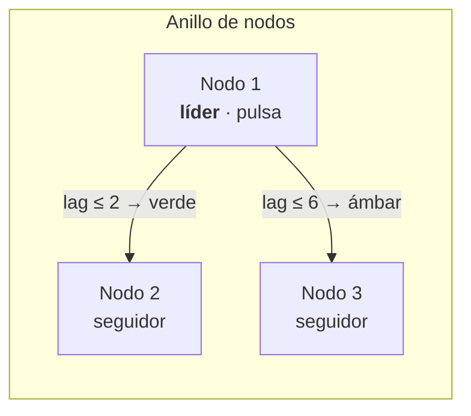

# 12. Visualización

> El sistema de color y los cuatro motores gráficos de la consola: qué hace cada uno, por qué
> conviven, cómo comparten una única fuente de color, y cómo se construyeron el Dashboard en
> vivo y la topología 3D del clúster.

## 12.1 Un sistema de color, no una paleta

Todo el color de la consola sale de `apps/web/src/styles/tokens.css`: una instancia validada
de una paleta de referencia, organizada por **roles semánticos**, no por tonos.

| Grupo | Tokens | Regla |
| ----- | ------ | ----- |
| Superficies | `--page` < `--surface` < `--elevated`, `--muted` | Luminancia ascendente; la jerarquía se lee sin bordes. |
| Tinta | `--foreground`, `--muted-foreground`, `--faint-foreground` | `faint` solo para texto **no esencial** (ejes, etiquetas). |
| Líneas | `--border`, `--border-strong`, `--grid`, `--axis` | Rejilla y eje son recesivos por definición. |
| Estado | `--success`, `--warning`, `--serious`, `--critical` | **Nunca se tematizan**: rojo es rojo en claro y en oscuro. |
| Categórica | `--series-1` … `--series-8` | Orden **fijo**, nunca cíclico. |

Tres reglas gobiernan su uso:

1. **Ningún componente elige color.** Consumen roles vía utilidades Tailwind (`bg-surface`,
   `text-critical`) mapeadas con `@theme inline`. Cambiar la paleta es tocar un fichero.
2. **Orden fijo en la categórica.** *Produce* es siempre `--series-1` y *fetch* siempre
   `--series-2`, en el Dashboard y en Historia. Un color que cambia de significado entre
   pantallas obliga a releer la leyenda cada vez.
3. **El color nunca informa solo.** Estado = color **+ icono + etiqueta**. La tasa de error
   lleva un check o un triángulo; la salud del clúster, texto explícito; las series, leyenda.

El tema se conmuta reasignando variables (ver [capítulo 6](./06-arquitectura-frontend.md),
§6.6) y el contraste AA está verificado por una prueba Playwright sobre el DOM real, en ambos
modos.

## 12.2 El puente a las gráficas: `useVizTokens`

ECharts, uPlot y react-three-fiber pintan sobre **canvas y WebGL**: no pueden usar
`var(--series-1)`. Necesitan el hex ya resuelto.

`useVizTokens` lee los valores computados del `:root` y —esto es lo que lo hace fiable— los
**re-lee cuando cambia el tema**, observando el atributo `data-theme` con un `MutationObserver`
más el media query del sistema. La relectura se agenda en el siguiente `requestAnimationFrame`,
cuando el estilo ya está recalculado.

Depender del orden de efectos de React habría producido el bug clásico: gráficas que se quedan
con los colores del tema anterior hasta el siguiente re-render.

## 12.3 Cuatro motores, cuatro trabajos

No es acumulación: cada librería está donde hace algo que las otras hacen peor.

| Motor | Dónde se usa | Por qué esa |
| ----- | ------------ | ----------- |
| **uPlot** | Dashboard en vivo, Historia | Series temporales a alta cadencia con coste mínimo. `setData()` actualiza sin reconstruir el objeto. |
| **ECharts** | Laboratorio `/lab` | Exploración y gráficas ricas con leyenda, tooltip y zoom de serie. |
| **visx** | Laboratorio `/lab` | Composición SVG: control total del marcado cuando el gráfico es parte del layout. |
| **react-three-fiber** | Topología 3D del clúster | Es la única forma razonable de mostrar un anillo de nodos con aristas de replicación en el espacio. |

Los cuatro wrappers viven en `features/viz/` y comparten contrato: reciben los tokens ya
resueltos, aplican grid y ejes recesivos, marcas de 2 px, y exponen `role="img"` con etiqueta
descriptiva.

Sus diferencias de ciclo de vida están resueltas en el wrapper, no en el llamador:

- **`EChart`** — `init`/`dispose`, `ResizeObserver`, y `setOption` con `notMerge` para que un
  cambio de tema reasigne **todos** los colores en lugar de fusionarlos con los viejos.
- **`UplotChart`** — uPlot es imperativo y no reestiliza en caliente, así que el plot se
  **reconstruye** cuando cambian opciones o tema; el tamaño se sincroniza con
  `ResizeObserver`.
- **`VisxAreaChart`** — SVG puro, se re-renderiza y re-colorea solo; responsive por medición
  del contenedor.
- **`ThreeClusterScene`** — `Canvas` de react-three-fiber con fondo igual a la superficie del
  tema.

ECharts y three.js entran por `import()` diferido en rutas propias, para no cargar el *bundle*
principal con lo que no se usa en el primer render.

## 12.4 El Dashboard en vivo

Dos gráficas uPlot alimentadas por la ventana deslizante de 150 muestras
([capítulo 11](./11-observabilidad-y-metricas.md)):

- **Throughput (peticiones/s)** — `produce` y `fetch`, con relleno translúcido.
- **Latencia de servicio** — p50, p99 y p999 en milisegundos.

`makeLiveOptions` centraliza el estilo:

| Decisión | Valor |
| -------- | ----- |
| Ejes y rejilla | `mutedForeground` y `--grid`: presentes, nunca protagonistas. |
| Leyenda | **Obligatoria** con ≥ 2 series. La identidad no puede depender del color. |
| Marcas | 2 px, con relleno `rgba` derivado del hex de la serie. |
| Texto | Siempre tinta, **nunca** el color de la serie: un p999 escrito en rojo se lee como alarma cuando solo es una serie. |
| Cursor | Puntos de 6 px, sin línea horizontal (ruido en series apiladas). |

## 12.5 La topología 3D del clúster

Es la pieza más visible y la que mejor ilustra que la visualización sirve para *entender*, no
para impresionar.

Muestra los nodos del clúster como esferas en un anillo (plano XZ, ordenados por `nodeId`) y,
para la **partición seleccionada**, dibuja el estado real del consenso Raft:

| Señal visual | Qué codifica |
| ------------ | ------------ |
| Halo | El nodo **local** (`isSelf`). |
| Pulso (*emissive* oscilante) | El **líder** de la partición activa. |
| Arista líder → seguidor | Que la réplica está en el consenso. |
| Color de arista | Salud del *lag*: verde ≤ 2, ámbar ≤ 6, rojo por encima. |
| Grosor de arista | Magnitud del retraso. |

Seleccionar otra fila en la tabla de consenso Raft cambia la partición activa y **la escena
responde**: el pulso se mueve al nuevo líder y las aristas se reorientan. Hay una prueba e2e
que verifica exactamente eso —seleccionar `orders.events-p2` y comprobar que el líder pasa de
Nodo 1 a Nodo 2.

El color de las aristas sale de los tokens de **estado**, no de la paleta categórica: es una
señal de salud, no una identidad de serie. Y como el color no puede informar solo, la tabla de
consenso a su lado muestra el mismo dato en números.

**Degradación honesta también aquí:** un broker de un solo nodo con `replication_factor = 1`
no tiene réplicas Raft. La escena muestra entonces el nodo con su halo, sin aristas, y el texto
«sin particiones replicadas». No es un error de la consola; es el estado real de ese
despliegue, dicho con claridad.

## 12.6 Accesibilidad de las gráficas

- **Etiquetadas**: cada wrapper expone `role="img"` con `aria-label` descriptivo.
- **Leyenda siempre** con dos o más series.
- **Contraste verificado** de todo el texto de la interfaz en claro y oscuro.
- **Paleta categórica** elegida para mantener separación perceptual en ambos temas.
- **Estado con icono y texto**, no solo color, en toda la superficie de la consola.

La regla de fondo: si alguien no distingue rojo de verde, la consola tiene que seguir siendo
operable. Por eso ningún dato crítico viaja solo en el canal cromático.
