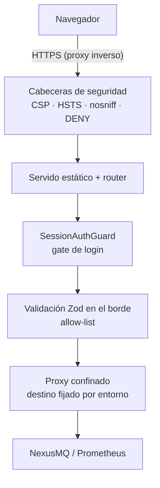

# 13. Seguridad

> El modelo de amenazas de la consola y las defensas que lo cubren, capa por capa. Los
> mecanismos concretos de sesión están en el [capítulo 9](./09-autenticacion-y-sesiones.md);
> aquí se ve el conjunto.

## 13.1 Modelo de amenazas

Qué hay que proteger y de quién:

| Activo | Amenaza | Defensa principal |
| ------ | ------- | ----------------- |
| JWT del operador | Robo por XSS, por *logging*, por respuesta filtrada | Confinado en servidor; cookie `httpOnly`; tests de no-fuga. |
| El broker | Acceso directo desde el navegador; SSRF a través del BFF | El destino se fija por entorno; el navegador no conoce la URL. |
| Prometheus | PromQL arbitraria (SSRF, DoS, exfiltración) | Allow-list de 10 ids; la consulta se construye en servidor. |
| Sesión del operador | CSRF, fijación, robo por red | `SameSite=Lax`, `Secure` en producción, id de 256 bits firmado con HMAC. |
| La propia consola | XSS, *clickjacking*, *sniffing* de MIME | CSP anclada a `'self'`, `frame-ancestors 'none'`, `nosniff`. |
| Datos operativos | Exposición sin autenticación | Gate de login activo por defecto; `metrics/snapshot` protegido. |

## 13.2 Capas de defensa



Ninguna capa es suficiente por sí sola, y esa es la idea.

## 13.3 Mismo origen, sin CORS

El BFF **no habilita CORS** en ningún caso. La SPA y la API comparten origen, así que:

- no se emite `Access-Control-Allow-Origin`, y el navegador bloquea cualquier lectura desde
  otro origen;
- la cookie funciona con `SameSite=Lax` (no hace falta `None`, que la expondría a contextos
  cross-site);
- `connect-src 'self'` en la CSP no necesita excepciones.

En desarrollo, Vite proxya `/api`, `/health`, `/healthz` y `/readyz` al BFF para preservar la
misma propiedad en local.

## 13.4 Cabeceras de seguridad

Se registran sobre el Express subyacente **antes** del servido estático y del router, de forma
que cubren **toda** respuesta —HTML, assets, JSON y SSE:

| Cabecera | Valor | Protege de |
| -------- | ----- | ---------- |
| `Content-Security-Policy` | Ver §13.5 | XSS, inyección de recursos. |
| `X-Content-Type-Options` | `nosniff` | MIME sniffing. |
| `X-Frame-Options` | `DENY` | Clickjacking (junto a `frame-ancestors 'none'`). |
| `Referrer-Policy` | `no-referrer` | Fuga de URLs internas a terceros. |
| `Cross-Origin-Opener-Policy` | `same-origin` | Aislamiento de contexto de navegación. |
| `Cross-Origin-Resource-Policy` | `same-origin` | Lectura de recursos por otros orígenes. |
| `Origin-Agent-Cluster` | `?1` | Aislamiento de agente. |
| `X-DNS-Prefetch-Control` | `off` | Resolución especulativa a terceros. |
| `Strict-Transport-Security` | `max-age=15552000; includeSubDomains` (solo producción) | Downgrade a HTTP. |
| `X-Powered-By` | **eliminada** | *Fingerprinting* del framework. |

HSTS solo se emite en producción: sobre HTTP en desarrollo sería ignorada, y anunciarla desde
`localhost` puede envenenar la caché HSTS del navegador para el desarrollo.

## 13.5 La CSP y el problema del script inline

```
default-src 'self'; base-uri 'self'; object-src 'none'; frame-ancestors 'none';
form-action 'self'; script-src 'self' 'sha256-…'; style-src 'self' 'unsafe-inline';
img-src 'self' data:; font-src 'self' data:; connect-src 'self'
```

Todo se sirve del mismo origen, así que la base es `'self'` sin excepciones de host.

Queda un problema real: el `index.html` de la SPA lleva **un script inline** —el anti-FOUC del
tema, que tiene que ejecutarse antes del primer *paint* para evitar el destello de tema
incorrecto. Las opciones eran `'unsafe-inline'` (que anula buena parte del valor de la CSP), un
*nonce* por petición (imposible sobre un fichero estático cacheado) o un **hash**.

La consola usa el hash, **calculado en el arranque a partir del `index.html` realmente
servido**:

```ts
const html = readIndexHtml(config.webDistPath);
const csp = buildCsp(html === undefined ? [] : inlineScriptHashes(html));
```

Es la diferencia entre un hash correcto y uno frágil: horneado en el código, se desincroniza
en cuanto Vite regenera el script y la aplicación deja de arrancar. Calculado del artefacto
desplegado, **siempre casa**.

`style-src` sí admite `'unsafe-inline'`, y conviene ser explícito sobre por qué: uPlot,
ECharts y react-three-fiber fijan estilos por atributo sobre sus elementos. Es una concesión
conocida y acotada al canal de estilos, que no permite ejecución de código.

## 13.6 Validación en el borde

Toda entrada del cliente se valida con Zod **antes** de tocar la red, con criterio de
allow-list: se declara lo permitido, no lo prohibido.

| Entrada | Regla | Qué evita |
| ------- | ----- | --------- |
| Paginación | `page ≥ 1`, `size ∈ [1, 100]` | Peticiones que arrastran el catálogo entero. |
| Nombre de topic | Obligatorio; se `encodeURIComponent` al construir la URL | Inyección de ruta. |
| `PATCH` de topic | `.strict()` | Envío de claves fuera del contrato. |
| `query_range` | `metric` de un enum cerrado; `start`/`end` Unix; `step`/`window` duraciones estrictas | PromQL arbitraria. |
| Login | `.strict()`, solo el token | Campos parásitos en el cuerpo. |
| Entorno del BFF | Esquema Zod completo, *fail-fast* | Arrancar en estado medio válido. |

Los errores de validación se devuelven como `problem+json` con `issues` por propiedad: útiles
para el cliente, sin filtrar detalles internos.

## 13.7 Anti-SSRF

Dos superficies podrían convertir al BFF en un proxy abierto, y ambas están cerradas:

**El destino del broker y de Prometheus se fija por entorno.** No hay ningún parámetro,
cabecera ni cuerpo que permita al navegador redirigir el BFF a otro host. Es también la razón
de que Ajustes **no** ofrezca cambiar de broker desde la interfaz: sería exactamente la
funcionalidad que abre el agujero (ver [capítulo 19](./19-limitaciones-y-trabajo-futuro.md)).

**La PromQL se construye en servidor.** El cliente envía un id de una lista de diez; el BFF
compone la consulta contra nombres de métrica fijos. La única parte parametrizada es la
ventana, validada como duración Prometheus. La superficie pasa de "cualquier consulta contra
la Prometheus interna" a "diez consultas conocidas".

## 13.8 Confinamiento del token

Recapitulado desde la perspectiva de seguridad:

- el JWT del broker vive en un `Map` en memoria del BFF, con TTL y purga;
- al navegador solo va `nexusmq_session = id.HMAC(id)`, `httpOnly` (inalcanzable para el
  JavaScript, incluso ante XSS);
- la firma se verifica en **tiempo constante** (`timingSafeEqual`);
- los endpoints de sesión devuelven exclusivamente `{ authenticated: boolean }`;
- los logs **nunca** registran el token ni la cookie.

Y no es una afirmación de diseño: hay pruebas e2e que verifican, sobre respuestas reales, que
el token no aparece en cuerpo, cabeceras ni cookie en ninguno de los caminos.

## 13.9 Gate de login por defecto

`CONSOLE_REQUIRE_LOGIN=true` en **todos** los entornos. Un broker en modo abierto no implica
que su consola deba ser pública: son dos decisiones distintas y ahora se toman por separado.

En la misma línea, `GET /api/v1/metrics/snapshot` pasó a `@Protected`. Antes era alcanzable
sin sesión incluso con el broker en modo secreto: una fuga de información operativa
—throughput, latencias, conexiones— para cualquiera que alcanzara la URL.

## 13.10 Superficie de despliegue

- **Imagen no-root**: corre como el usuario `node` (uid 1000).
- **Secretos por entorno**, nunca horneados en la imagen ni versionados. `.env` está en
  `.gitignore`; `.env.example` documenta las claves sin valores.
- **`SESSION_SECRET` de ≥ 32 caracteres**, exigido por el esquema; el arranque falla si no.
- **TLS terminado en un proxy inverso** delante. Con `NODE_ENV=production` la cookie es
  `Secure`, así que servir la consola por HTTP en producción la deja sin sesión — un fallo
  ruidoso, que es lo que se quiere.
- **TLS hacia el broker** validado por defecto (`BROKER_TLS_REJECT_UNAUTHORIZED=true`);
  relajarlo es una decisión explícita, y hay `NODE_EXTRA_CA_CERTS` para el caso legítimo de una
  CA propia.
- **Superficie mínima**: la imagen de runtime contiene solo las dependencias de producción del
  BFF, su `dist` y el build de la SPA. Sin devDependencies, sin código fuente, sin `curl` (el
  `HEALTHCHECK` usa el `fetch` nativo de Node).

## 13.11 Lo que queda fuera

Honestidad sobre los límites, con su justificación:

- **Sesiones en memoria.** Una sola instancia; escalar horizontalmente exigiría un almacén
  compartido. Suficiente para v1 y explícito en el diseño.
- **Sin rotación de `SESSION_SECRET` en caliente.** Cambiarlo invalida todas las sesiones —que
  es el comportamiento correcto, pero no hay rotación gradual.
- **Sin rate limiting** en el login. La validación del token la hace el broker, que tiene su
  propia protección; añadir un limitador en el BFF es trabajo futuro razonable.
- **Sin auditoría de acciones.** Quién borró qué topic y cuándo no queda registrado por la
  consola. Es una carencia real para un entorno multi-operador.
