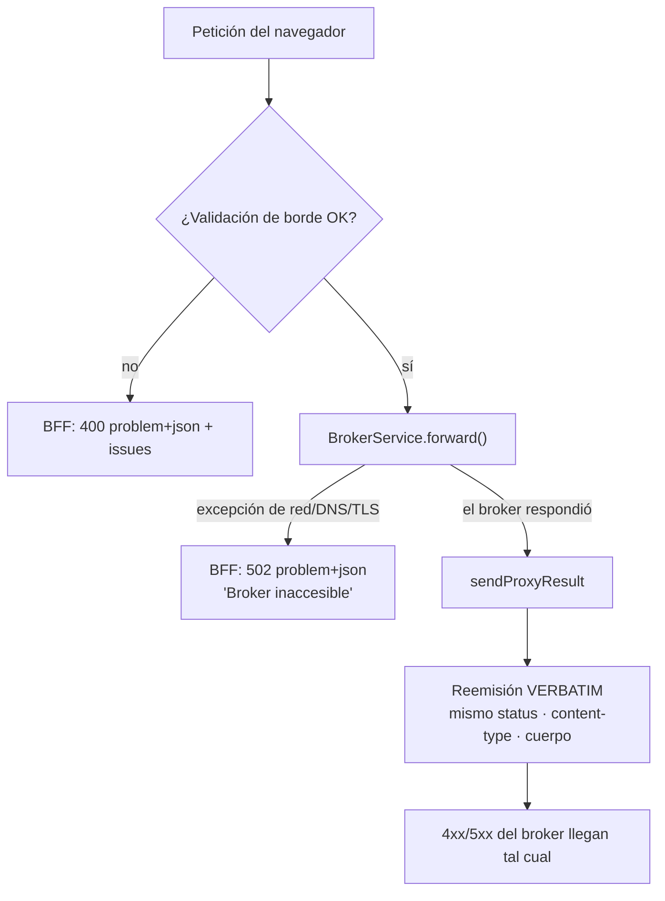

# 14. Modelo de errores

> Un único formato de error de punta a punta —RFC 7807— y una regla clara de quién genera qué.
> Es lo que permite que la consola muestre siempre algo coherente, venga el fallo de donde
> venga.

## 14.1 Un solo formato: RFC 7807

El broker emite `application/problem+json`. El BFF también. La SPA tiene, por tanto, **un solo
modelo de error** para toda la aplicación, y lo toma del contrato generado:

```ts
export type ProblemDetail = components['schemas']['ProblemDetail'];
```

El documento tiene la forma estándar:

| Campo | Uso |
| ----- | --- |
| `type` | URI del tipo de problema. Por defecto `about:blank`. |
| `title` | Resumen corto y legible. Es lo que la UI muestra como encabezado. |
| `status` | Código HTTP. |
| `detail` | Explicación concreta de **esta** ocurrencia. Es lo que la UI muestra como cuerpo. |
| `instance` | Referencia a la ocurrencia, si aplica. |
| `issues` | Extensión del BFF: lista de `{ path, message }` para errores de validación. |

`issues` es una extensión propia, permitida por la RFC. Sin ella, un 400 de validación diría
"solicitud inválida" sin decir **qué** propiedad falla.

## 14.2 Quién genera qué

La regla que gobierna todo el modelo:

> **El BFF solo fabrica los errores que son suyos. Los del broker se reemiten intactos.**



| Origen | Ejemplos | Quién lo produce |
| ------ | -------- | ---------------- |
| Validación de entrada | `size=500`, `PATCH` con clave desconocida, `metric` fuera de la allow-list | BFF → 400 con `issues`. |
| Broker inaccesible | DNS, red caída, TLS, timeout | BFF → 502. |
| Autenticación | Sin sesión en ruta protegida, token rechazado | BFF → 401. |
| Prometheus | Consulta inválida → 400; caído o 5xx → 502 | BFF. |
| Dominio del broker | Topic ya existe (409), no encontrado (404), token inválido (401) | **Broker**, reemitido *verbatim*. |
| Inesperado | Bug no capturado | BFF → 500 «Error interno», sin detalles internos. |

Por qué no traducir los errores del broker: cualquier traducción crea una segunda definición
del dominio que puede divergir de la primera. Si el broker devuelve un `409` explicando que el
topic ya existe, ese es el mejor error posible — el BFF no tiene información adicional que
aportar y sí muchas formas de estropearla.

## 14.3 En el BFF: el filtro global

`ProblemDetailsFilter` (`@Catch()`, registrado como `APP_FILTER`) captura **cualquier**
excepción no gestionada y la traduce:

```ts
if (exception instanceof BrokerUnreachableError) → 502 «Broker inaccesible»
if (exception instanceof HttpException)          → status + title/detail/issues del payload
otherwise                                        → 500 «Error interno» (mensaje registrado, no expuesto)
```

Dos detalles deliberados:

- **El 500 genérico no filtra nada.** El mensaje real va al log; al cliente le llega solo
  «Error interno». Un *stack trace* en una respuesta es información para un atacante.
- **Las respuestas del proxy no pasan por aquí.** `sendProxyResult` escribe directamente el
  status y el cuerpo del broker; el filtro solo actúa sobre excepciones. Es lo que garantiza la
  reemisión *verbatim*.

`sendProxyResult` preserva además la cabecera `Location` cuando el broker la envía (el `201`
al crear un topic), porque forma parte de la respuesta del contrato.

## 14.4 En la SPA: normalización en un único punto

`openapi-fetch` devuelve `{ data, error, response }` en lugar de lanzar. La conversión a
excepción ocurre en un solo sitio, `lib/problem.ts`:

```ts
export function unwrap<T>(result: FetchResult<T>): T {
  if (result.data !== undefined) return result.data;
  throw new ProblemError(toProblem(result.error, result.response.status));
}
```

`toProblem` es la red de seguridad: si el cuerpo **no** tiene forma de `ProblemDetail`
—respuesta opaca, error de red sin respuesta, HTML de un proxy intermedio— **sintetiza** uno
con el status recibido. La UI siempre tiene algo coherente que mostrar; nunca un
`undefined.title`.

Hay una variante `unwrapVoid` para respuestas sin cuerpo (el `204` de un `DELETE`), que solo
comprueba el estado.

`ProblemError` envuelve el documento para que cualquier capa —TanStack Query, componentes— lo
trate de forma uniforme, y expone `status` para las decisiones de reintento.

## 14.5 Reintentos: distinguir determinista de transitorio

```ts
retry: (failureCount, error) => {
  if (error instanceof ProblemError && error.status >= 400 && error.status < 500) return false;
  return failureCount < 2;
}
```

Un 4xx es **determinista**: el servidor ya dijo que la petición está mal, y repetirla producirá
la misma respuesta. Un fallo de red o un 5xx puede ser transitorio y merece dos reintentos con
*backoff*.

Reintentar un 401 solo consigue tres 401 y retrasa la redirección al login.

## 14.6 En la interfaz

`ProblemAlert` es el único componente de error de la consola, y aplica las reglas del sistema
de diseño:

| Elemento | Regla |
| -------- | ----- |
| Icono | `TriangleAlert` en color `critical` — **el color nunca informa solo**. |
| `title` | Encabezado, en tinta normal. |
| `detail` | Cuerpo, en tinta secundaria. Se omite si viene vacío. |
| `status` | «Código HTTP 409», en tinta tenue. Se omite si es 0 (error de red). |
| Reintento | Botón opcional, solo donde reintentar tiene sentido. |
| Semántica | `role="alert"`, para que los lectores de pantalla lo anuncien. |

Se usa igual en el guard de acceso, en las vistas de datos y en el formulario de login. Un
error de token inválido, por ejemplo, muestra el `problem+json` real del BFF —«Token
rechazado» / «El broker no aceptó el token proporcionado»— y hay una prueba e2e que verifica
justo eso.

## 14.7 Degradación frente a error

No todo lo que "no hay" es un error, y la consola distingue los dos casos:

| Situación | Tratamiento | Por qué |
| --------- | ----------- | ------- |
| Prometheus no configurado | `200 { available: false, reason }` + aviso honesto en la UI | Es una **configuración**, no un fallo. Con un error, la vista mostraría una alarma roja por algo que el operador decidió. |
| Métrica que el broker no emite | «—» en el tile | El dato no existe; un 0 mentiría. |
| Lista vacía (grupos, topics) | *Empty state* explicativo | Un resultado válido, no un error. |
| Prometheus configurado pero caído | **502** `problem+json` | Esto **sí** es un fallo: algo que debería responder no responde. |

La línea es clara: si el sistema está como debería y simplemente no hay dato, se degrada. Si
algo que debería funcionar no funciona, se avisa.
