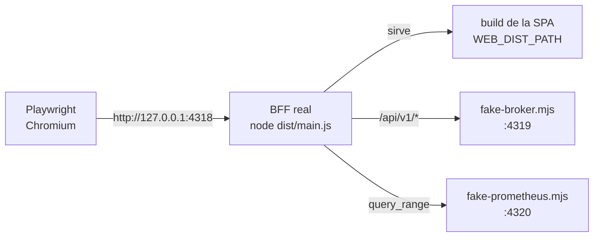

# 15. Estrategia de pruebas

> Qué se prueba, con qué herramienta y por qué. La tesis: **un doble solo vale si emite lo que
> emite el original**, y una feature con superficie visual no está hecha hasta que se ha visto
> funcionar en un navegador.

## 15.1 Los cuatro niveles

| Nivel | Herramienta | Cuántas | Qué verifica |
| ----- | ----------- | ------- | ------------ |
| Unitario de la SPA (lógica pura) | Vitest | 23 (web 22 · contract 1) | Cuantiles, tasas, ventanas, PromQL, alineado de series. |
| Unitario e integración del BFF | Vitest + supertest, contra dobles | 82 | Módulos puros (config, backpressure, CSP, allow-list) y cada endpoint sobre HTTP real. |
| e2e de la SPA | Playwright / Chromium sobre `vite preview` | 7 | Shell, navegación, tema, contraste AA, arsenal de viz. |
| e2e full-stack | Playwright sobre la topología de producción | 14 | SPA → BFF real → doble del broker + doble de Prometheus. |

**126 pruebas** en total. La proporción es intencionada: la mayor parte del riesgo de esta
consola está en la **frontera** —el diálogo con el broker y con el navegador—, no en funciones
aisladas.

## 15.2 Unitario: solo lógica pura

Los tests unitarios de la SPA no montan un DOM. No hace falta, porque toda la lógica que
merece prueba vive en módulos sin React:

| Módulo | Qué cubre |
| ------ | --------- |
| `metrics-snapshot.ts` | `histogramQuantile` (interpolación, cubo `+Inf`), `deltaHistogram`, filtrado por etiqueta, agregación de histograma por `le`, `groupGaugeByLabel` con degradación a `null`. |
| `history-range.ts` | Presets de ventana, parseo de la `matrix`, alineado de series con huecos. |

Es una consecuencia directa del principio de separar modelo puro de adaptadores
([capítulo 5](./05-principios-de-diseno.md), §5.3): si hubiera que montar un componente para
probar un cuantil, la capa estaría mal puesta.

Los tests **asertan el contrato, no la implementación**. Por ejemplo, el nombre de métrica que
esperan es literalmente `'nexus_broker_requests_total'`, y el campo de un grupo es `groupId` —
lo que emite el broker real. Si alguien "simplifica" el nombre, el test falla.

## 15.3 Integración del BFF: contra dobles, sobre HTTP real

Vitest + supertest, con `unplugin-swc` para la metadata de decoradores de NestJS. Cada suite
levanta un **doble del broker** (o de Prometheus) en un puerto efímero y ejercita el BFF de
verdad por HTTP.

Cobertura, por área:

| Área | Ejemplos de caso |
| ---- | ---------------- |
| Proxy REST | Éxito por endpoint; 404/409 del broker propagados; 400 de borde (`size`, `name`, `segmentBytes`); 502 con broker caído. |
| Auth | 401 sin sesión; login inválido/válido; proxy con sesión; `session`; logout; modo abierto; **no-fuga del token** en cuerpo, cabeceras y cookie. |
| Sesiones | Sesión fresca resuelve; vencida da 401 y **sale del `Map`**; `purgeExpired` cuenta; el barrido periódico purga. |
| Modo del broker | Cachea dentro del TTL; **re-sondea a los 61 s**. |
| SSE | Recibe frames; **reconecta** manteniendo viva la conexión del cliente; **cierre limpio** (upstream a 0 al irse el cliente). |
| Backpressure | `write` true resuelve; `write` false espera a `drain`; `abort` no cuelga; **cliente lento ⇒ un solo chunk leído**. |
| Prometheus | Con y sin Prometheus; métrica fuera de la allow-list → 400; `step` no-duración → 400; degradado → `available:false`; inaccesible → 502; sin sesión → 401. |
| Cabeceras | CSP con el hash inline exacto; ausencia de `X-Powered-By`; cabeceras presentes en respuestas reales. |
| Servido estático | `/` y deep links sirven `index.html`; assets reales; `/health` sigue en JSON; `/api/*` desconocida da 404 `problem+json`; sin `WEB_DIST_PATH`, no se sirve SPA pero la API vive. |
| Config | `validateEnv` rechaza entorno inválido con detalle por clave; defaults correctos. |

Las pruebas de SSE y de backpressure merecen mención: son **deterministas**, no dependen de
temporizadores reales ni de esperas arbitrarias. La de reconexión usa un doble que cierra tras
cada frame y comprueba que hay ≥ 2 conexiones upstream mientras el cliente **no** sufre corte.

## 15.4 e2e de la SPA

Playwright sobre el **build de producción** servido por `vite preview` — no sobre el dev
server, para que se pruebe el artefacto real:

- render del shell y navegación con `aria-current`;
- toggle de tema y persistencia al recargar;
- **contraste AA (≥ 4.5:1)** del texto sobre página y superficie, en claro y oscuro, medido
  sobre el DOM;
- 404 dentro del shell;
- el laboratorio de visualización renderiza las cuatro librerías (3 `<canvas>` incluido WebGL +
  SVG de visx) y respeta el tema oscuro.

Estas siete pruebas corren **sin BFF**, así que simulan la sesión con `page.route()`. Es la
única suite donde se mockea la red, y es porque su objeto de prueba es la capa visual.

## 15.5 e2e full-stack: la topología de producción

Las 14 pruebas que más valor aportan. Playwright levanta **tres procesos**:



Es **exactamente** la topología de producción: el BFF sirviendo la SPA y proxyando, con la
cookie `httpOnly` de por medio y mismo origen. No hay `page.route()` sustituyendo la API, salvo
en los dos casos donde el objetivo del test **es** forzar una respuesta degradada.

`NODE_ENV` se deja sin fijar a propósito: así la cookie no es `Secure` y el navegador la
acepta sobre `http://127.0.0.1`. El gate de login corre **activo**, como en producción.

Qué se verifica de punta a punta:

| Suite | Verificación |
| ----- | ------------ |
| `data` | Guard redirige sin sesión; deep link protegido; error RFC 7807 con token inválido; **login → Topics lista los topics reales del broker**; persistencia; logout. |
| `dashboard` | Pasa a **en vivo (SSE)**, el contador de muestras **avanza en < 2 s**, p99 en ms, salud del clúster y estado Raft real; las dos gráficas dibujan en canvas. |
| `topics` | Crear → describir → **`PATCH` de retención con efecto real** («1 h» que persiste tras recargar) → borrar. |
| `groups` | Lista con estado → describe con miembros y **lag real por partición**. |
| `partitions` | Columna «Lag réplica»; p0 replicada con lag numérico; p3 fuera del consenso con «—». |
| `cluster` | Nodos, consenso Raft, topología 3D en WebGL, y **el líder cambia** al seleccionar otra partición. |
| `history` | Series desde Prometheus con leyenda; cambiar de ventana re-consulta; **modo degradado** con aviso honesto. |
| `live` | Push en vivo por SSE → **caída a polling** al forzar el fallo → vuelta a vivo. |
| `settings` | Cambio de tema, estado de conexión, y logout desde la interfaz. |

El doble del broker es **stateful**: `POST`/`GET {name}`/`PATCH`/`DELETE` con persistencia en
memoria. Sin eso, "editar la retención y ver el efecto" no sería una prueba de nada.

## 15.6 Los dobles emiten el contrato real

Es la lección más importante del proyecto, y ahora es una regla:

> Durante las fases 1–4 los dobles emitían nombres de métrica inventados que coincidían con
> los que la consola esperaba. Todos los tests pasaban. Contra el broker real, el Dashboard
> salió vacío.

Desde la fase 5, **todos** los dobles están alineados con el contrato real del broker:

| Doble | Emite |
| ----- | ----- |
| `test/broker-double.ts` | `nexus_broker_*` con `{api, protocol}` y `{plane}`; `GroupDescription` con `groupId`; `ClusterInfo` con `{nodeId, nodes:[{nodeId, isSelf}], partitions}`; páginas sin `total`. |
| `test/prometheus-double.ts` | `nexus_broker_requests_total` con `api: produce`. |
| `e2e-fullstack/fake-broker.mjs` | Igual, además de SSE y snapshot desde **un reloj único** (para que stream y snapshot sean coherentes). |
| `e2e-fullstack/fake-prometheus.mjs` | `query_range` con forma según la consulta. |

Y los tests unitarios asertan esos mismos nombres. Un doble que confirma las suposiciones del
cliente no prueba nada; solo las documenta.

## 15.7 Verificación en navegador como criterio de "hecho"

Ninguna feature con superficie visual se dio por terminada por compilar y pasar tests. El
criterio fue **arrancarla y verla**: la vista pinta, el endpoint responde, el SSE emite, el
`PATCH` tiene efecto y persiste tras recargar.

De ahí salen los detalles que ninguna prueba unitaria habría encontrado: que uPlot no
reestiliza en caliente y hay que reconstruir el plot al cambiar de tema; que la CSP con hash
inline debía calcularse del artefacto servido y no hornearse; que Turborepo filtraba el
entorno de la tarea `dev` y el BFF abortaba.

## 15.8 Cómo se ejecuta

```bash
pnpm test                                   # unitario + integración (105)
pnpm --filter @nexusmq/web test:e2e         # e2e SPA (7, Chromium)
pnpm --filter @nexusmq/web test:e2e:data    # e2e full-stack (14, SPA→BFF→dobles)
```

`test:e2e:data` construye antes el BFF y la SPA: prueba **artefactos**, no fuentes. Si
Playwright pide navegador: `pnpm exec playwright install chromium`.
