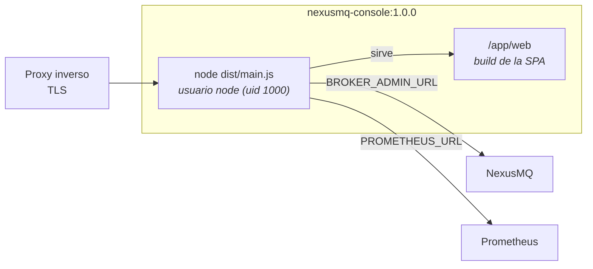

# 17. Despliegue

> Cómo se empaqueta y se pone en marcha la consola: una imagen Docker multi-stage, un
> `docker-compose` de ejemplo y las condiciones de producción (TLS, *probes*, red).

## 17.1 Un solo artefacto

La consola se despliega como **una sola imagen**: el BFF NestJS que sirve la SPA ya construida.
No hay nginx delante sirviendo estáticos, ni dos contenedores que coordinar.



El broker y Prometheus son **externos** y se apuntan por variables de entorno. Nunca se hornean
en la imagen: la misma imagen sirve para todos los entornos, y lo que cambia es la
configuración (12-factor).

## 17.2 La imagen: multi-stage

**Etapa `builder`** (`node:22-slim`, pnpm vía corepack):

1. **Manifiestos primero** — `pnpm-lock.yaml`, `pnpm-workspace.yaml` y los cuatro
   `package.json`, seguidos de `pnpm install --frozen-lockfile`. Así la capa de dependencias
   **se cachea** y no se invalida al cambiar código.
2. **Código y build** — `pnpm generate && pnpm build`: tipos del contrato, SPA con Vite, BFF
   con `tsc`.
3. **Aislamiento del runtime** — `pnpm --filter @nexusmq/bff --legacy deploy --prod /out`
   produce un `node_modules` autocontenido con **solo** las dependencias de producción del BFF.
   Sin devDependencies y sin `@nexusmq/contract`, que en el BFF es *type-only* y desaparece al
   compilar. El flag `--legacy` es necesario porque el workspace no inyecta paquetes.

**Etapa `runtime`** (`node:22-slim`, mínima):

```dockerfile
ENV NODE_ENV=production PORT=3000 WEB_DIST_PATH=/app/web
COPY --from=builder --chown=node:node /out/node_modules ./node_modules
COPY --from=builder --chown=node:node /out/dist         ./dist
COPY --from=builder --chown=node:node /out/package.json ./package.json
COPY --from=builder --chown=node:node /repo/apps/web/dist ./web
USER node
```

Solo el artefacto: sin código fuente, sin herramientas de build, sin devDependencies. Corre
como el usuario **no-root** `node` (uid 1000), que la imagen base ya trae.

## 17.3 HEALTHCHECK propio

```dockerfile
HEALTHCHECK --interval=30s --timeout=5s --start-period=20s --retries=3 \
  CMD node -e "fetch('http://127.0.0.1:'+(process.env.PORT||3000)+'/health')\
      .then(r=>{if(!r.ok)process.exit(1)}).catch(()=>process.exit(1))"
```

Dos decisiones:

- **Comprueba que el BFF responde de verdad**, no solo que el proceso vive. Un proceso Node
  colgado sigue existiendo.
- **Usa el `fetch` nativo de Node 22**, no `curl`. La imagen base no lo trae, y añadirlo solo
  para el healthcheck ampliaría la superficie sin necesidad.

`/health` es del BFF y **no** consulta al broker, deliberadamente: si dependiera del broker, una
caída del broker haría que el orquestador reiniciara la consola en bucle sin arreglar nada.

## 17.4 Ejecución directa

```bash
docker build -t nexusmq-console:1.0.0 .

docker run --rm -p 3000:3000 \
  -e BROKER_ADMIN_URL=http://broker:8080 \
  -e PROMETHEUS_URL=http://prometheus:9090 \
  -e SESSION_SECRET="$(openssl rand -hex 32)" \
  nexusmq-console:1.0.0
```

`SESSION_SECRET` es obligatorio y debe tener ≥ 32 caracteres. Si falta, el arranque **falla con
mensaje claro y código 1** — no arranca en un estado degradado silencioso.

## 17.5 docker-compose de ejemplo

`docker-compose.yml` levanta **console + broker + prometheus**:

```bash
export SESSION_SECRET="$(openssl rand -hex 32)"
docker compose up --build      # consola en http://localhost:3000
```

| Servicio | Notas |
| -------- | ----- |
| `console` | Se construye del `Dockerfile`. `SESSION_SECRET` con sintaxis `${VAR:?mensaje}`: compose falla si no está definida. Healthcheck y `restart: unless-stopped`. |
| `broker` | **Placeholder.** Sustituye su `image:` por la del broker NexusMQ real. Expone `:8080` (admin) y `:9091` (métricas). |
| `prometheus` | `prom/prometheus:v3.1.0`, con `deploy/prometheus.yml` montado en solo lectura y un volumen para los datos. |

`deploy/prometheus.yml` raspa `broker:9091/metrics` cada 15 s. Ese es el camino completo:
broker → Prometheus → BFF (`query_range`) → vista de Historia.

Solo el puerto de la consola se publica al host; broker y Prometheus quedan en la red interna
de compose. El de Prometheus está comentado para poder inspeccionarlo durante el desarrollo.

## 17.6 Producción y TLS

La consola habla **HTTP en claro** dentro de su red y **termina TLS en un proxy inverso**
delante (nginx, Traefik, ingress de Kubernetes).

Con `NODE_ENV=production` —que la imagen ya fija— la cookie de sesión es `Secure` y se emite
HSTS. La consecuencia práctica es directa: **servirla por HTTP en producción la deja sin
sesión**. Es un fallo ruidoso y buscado, preferible a una cookie de sesión viajando en claro.

Si el proxy hace *buffering*, hay que desactivarlo para `/api/v1/stream`. El BFF ya envía
`X-Accel-Buffering: no` y `Cache-Control: no-transform`, que nginx respeta.

Para las *probes* del orquestador:

| Probe | Endpoint | Por qué |
| ----- | -------- | ------- |
| Liveness | `GET /health` | Salud del BFF. No depende del broker. |
| Readiness | `GET /readyz` | Preparación del broker: si el broker no está listo, la consola no tiene nada que servir. |

## 17.7 Estado de verificación

Honestidad sobre qué se probó y cómo: **Docker no estaba instalado en el entorno de
desarrollo**, así que `docker build` y `docker compose up` no llegaron a ejecutarse aquí. El
runtime de la imagen se reprodujo **sin el demonio**, y eso sí quedó verificado:

- `pnpm --filter @nexusmq/bff --legacy deploy --prod` produce el bundle correcto (dependencias
  de runtime exactas, contrato ausente por ser type-only);
- arrancar `node dist/main.js` con el entorno de producción **sirve la SPA** (`/`, `<title>`,
  assets), el **deep link** `/history` (fallback SPA → 200), `/health` y `/api/history/status`;
- el **comando del `HEALTHCHECK`** devuelve exit 0 sano y exit 1 con el servicio caído;
- las cabeceras de seguridad aparecen en respuestas reales, con el **hash CSP exacto** del
  index servido;
- el YAML de compose y el de Prometheus validan.

Queda pendiente ejecutar `docker compose up` en una máquina con Docker. Está anotado en el
[capítulo 19](./19-limitaciones-y-trabajo-futuro.md).
